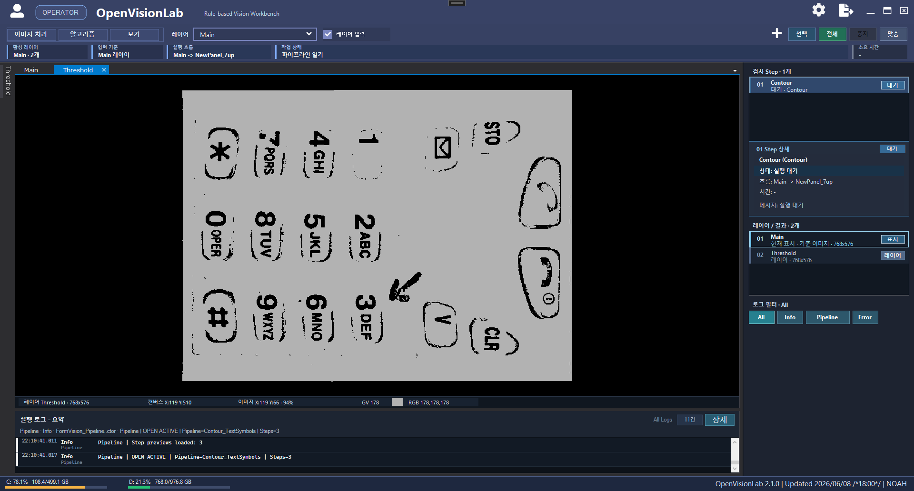
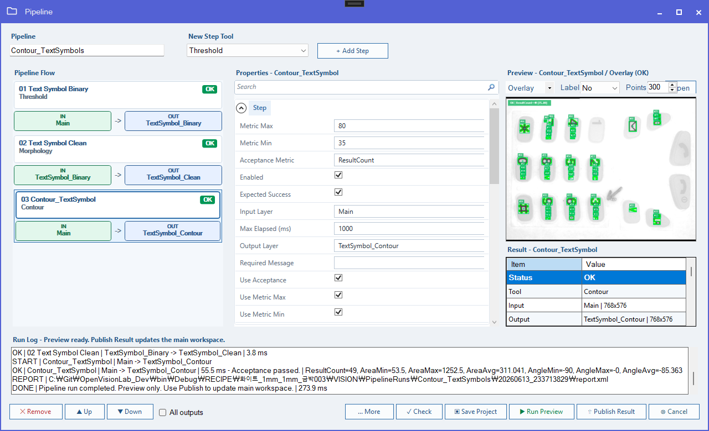
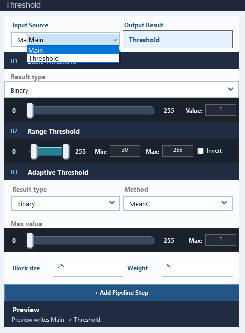
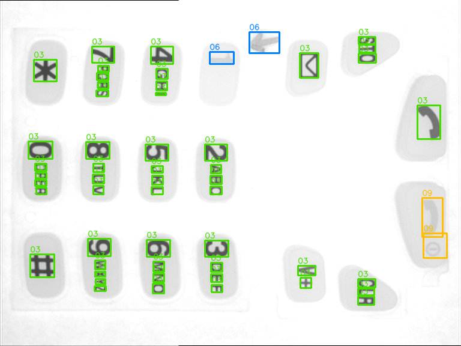

# OpenVisionLab (오픈비전 랩)

OpenVisionLab은 OpenCV/OpenCvSharp 검사 레시피를 구축, 테스트, 검증 및 재사용하기 위한 Rule-base 기반의 비전 워크벤치(Workbench)입니다.

이 프로젝트의 목표는 단순히 내부적인 이미지 처리 툴을 제공하는 것에 그치지 않습니다. 비전 개발의 접근성을 높이는 것이 핵심입니다. 이미지를 불러오고, OpenCV 파라미터를 튜닝하며, 파이프라인을 구축하고, 오버레이와 측정값(Metrics)으로 결과를 검증한 뒤, 이를 XML로 저장하여 UI, 배치(Batch) 작업, AI 레시피 Import, 또는 외부 러너(DLL) 등에서 동일하게 재사용할 수 있도록 지원합니다.



## 🎯 개발 방향성 (Direction)

OpenVisionLab은 OpenCvSharp 검사 레시피 플랫폼으로 진화하고 있습니다. 
사용자가 다음 네 가지 질문에 빠르게 답을 얻을 수 있도록 돕습니다:

- 이 단계(Step)는 어떤 이미지나 레이어를 읽고 있는가?
- 이 단계는 어떤 출력 레이어를 생성하는가?
- 툴이 예상한 대상을 정확히 검출했는가? 그리고 그 이유는 무엇인가?
- 검증된 이 레시피를 UI 외부에서도 재사용할 수 있는가?

장기적인 개발 방향성은 다음과 같습니다:
1. **메인 워크스페이스**를 사용하여 이미지 로드, 레이어 리뷰, ROI, 좌표, 픽셀 정보, 확대/축소, GV 및 RGB 검사를 수행합니다.
2. 각 **비전 툴 폼**을 활용해 OpenCV 파라미터를 빠르게 튜닝하고 즉각적으로 미리보기를 확인합니다.
3. **Pipeline 폼**을 사용하여 툴들을 반복 가능한 레시피로 결합합니다.
4. 측정값(Metrics), 오버레이, 합격 기준(Acceptance rules), 로그 및 리포트를 통해 결과를 검증합니다.
5. 승인된 파이프라인을 **XML로 저장**합니다.
6. 저장된 XML을 OpenVisionLab 내부, 샘플/배치 검증, AI 레시피 Import 또는 외부 러너(DLL)를 통해 동일하게 실행합니다.

---

## 🖥 현재 UI (Current UI)

### 메인 워크스페이스 (Main Workspace)
메인 화면은 레이어 기반의 이미지 워크스페이스입니다. 원본 및 결과 이미지를 검사하고 현재 파이프라인 상태, 단계별 상태, 레이어, 로그 및 픽셀 정보를 리뷰하는 데 사용됩니다.


### 파이프라인 워크벤치 (Pipeline Workbench)
Pipeline 폼은 현재 플랫폼 방향성의 중심입니다. 각 단계는 명시적인 입력 레이어와 출력 레이어를 가집니다. 일반적인 체인형 단계는 이전 출력값을 따르며, 브랜치(Branch) 단계도 허용되지만 의도적이어야 하고 리뷰가 가능해야 합니다.

`Run Preview`는 결과를 Pipeline 폼 내부에만 유지합니다. `Publish Result`는 선택된 결과 또는 요약(Summary) 결과를 메인 워크스페이스로 내보냅니다.


### Threshold 툴 (Threshold Tool)
툴 폼은 OpenCV의 동작을 가장 빠르게 이해하고 튜닝할 수 있는 방법이므로 여전히 중요합니다. Threshold, Range Threshold, Adaptive Threshold, Morphology, Contour, Blob, Line, Matching 등의 툴들이 동일한 `RunVisionStep` 및 파이프라인 단계 규격에 맞춰 정렬되고 있습니다.


### AI / LLM 레시피 요약 (AI / LLM Recipe Summary)
LLM은 이미지와 검사 목표를 바탕으로 1차 파이프라인 XML을 제안할 수 있습니다. 이후 OpenVisionLab은 해당 XML을 Import하고, 유효성을 검증하며, 미리보기를 실행하고 튜닝합니다. 최종 리뷰 화면에서는 마지막 단계뿐만 아니라 감지된 모든 오버레이를 하나의 이미지에 통합하여 보여줍니다.


---

## 💡 주요 기능 (Core Features)

- 이미지 로드, 레이어 디스플레이, 줌/팬, ROI, 좌표, 픽셀, GV, RGB 검사.
- 직접적인 파라미터 튜닝을 위한 OpenCV/OpenCvSharp 툴 폼 제공.
- 명시적인 입력/출력 레이어를 갖춘 파이프라인 단계 편집.
- 파이프라인의 **미리보기(Preview)**와 **내보내기(Publish)** 기능 분리.
- 여러 검출 단계의 오버레이를 하나의 리뷰 이미지로 결합하는 **요약 미리보기(Summary Preview)**.
- `ResultCount`, 면적, 각도, 점수, 엣지 수, 평균값 등의 측정 기준 및 합격 판정 룰 지원.
- 파이프라인 XML Import/Load/Save.
- 반복적인 '이미지 + 레시피 + 예상 결과값' 검증을 위한 샘플 카탈로그.
- LLM이 생성한 `VisionPipeline` XML을 위한 AI 레시피 Import 플로우.
- `VisionRecipeRunner`를 통한 UI 독립적인 레시피 실행.
- 로깅, 메시지 다이얼로그 및 실행 리포트 인프라.

---

## 🔍 비전 검사 툴 (Vision Tools)

현재 파이프라인은 다음의 툴 패밀리를 지원합니다:

| 툴 (Tool) | 목적 (Purpose) |
| :--- | :--- |
| `Threshold` | 이진화, 다중 범위(Range), 적응형(Adaptive) 이진화 전처리 |
| `Morphology` | Erode, Dilate, Open, Close 및 그래디언트 스타일 이미지 정리 |
| `Filter` | Blur 및 스무딩 연산 |
| `EdgeDetection` | 엣지 맵 생성 |
| `Blob` | 연결된 객체 검출 및 면적 필터링 |
| `Contour` | 도형, 텍스트, 심볼 후보군 검출 |
| `LineGauge` / `Line` | 엣지 및 라인 기반의 정밀 길이 측정 및 교차점 검사 |
| `Matching` | 템플릿 기반 패턴 매칭 |
| `FeatureMatching` | 특징점 기반 매칭 |
| `Mean` / `Histogram` / `HSV` | 명도 및 컬러 스페이스 검사 |
| `RotateAndScale` / `Arithmetic` | 이미지 변환 및 병합 유틸리티 |

플랫폼에 적용되는 모든 툴은 다음 규칙을 따릅니다:
- 공통 실행 경로를 통해 툴 폼에서 실행 가능해야 합니다.
- 프로퍼티 값을 `VisionPipelineStep.Parameters`로 변환해야 합니다.
- 파이프라인 런타임에서 실행 가능해야 합니다.
- 적용 가능한 경우 결과 이미지를 반환해야 합니다.
- 사용자가 결과를 판단할 수 있도록 측정값(Metrics)과 오버레이를 반환해야 합니다.
- XML을 통해 정확하게 저장/로드되어야 합니다.

---

## 🔗 파이프라인 컨셉 (Pipeline Concept)

파이프라인 XML은 재사용 가능한 검사 레시피입니다.

```text
Main image
  -> Threshold
  -> Morphology
  -> Contour / Blob / Matching / Line
  -> Metrics + Overlays + Acceptance
  -> Summary Preview
  -> Publish Result or save XML
중요한 UX 규칙:

Run Preview는 예기치 않게 메인 워크스페이스를 덮어쓰지 않아야 합니다.

Publish Result는 결과 레이어를 다시 기록하는 명시적인 동작입니다.

단계(Step)는 기본적으로 이전의 활성화된 단계의 출력을 읽습니다.

브랜치(Branch) 단계는 Main 또는 다른 레이어를 읽을 수 있지만, 사용자에게 시각적으로 표시되어야 합니다.

최종 리뷰에서는 여러 브랜치가 관련된 경우 통합된 검출 결과를 하나의 이미지에 표시해야 합니다.

🤖 AI 레시피 방향성 (AI Recipe Direction)
AI/LLM 연동은 최종 결정권자가 아닌 '레시피 어시스턴트(보조자)'로 취급됩니다.

권장되는 워크플로우:

Plaintext
사용자 이미지 + 검사 목표
  -> LLM이 VisionPipeline XML 제안
  -> OpenVisionLab에서 XML 유효성 검증
  -> OpenVisionLab에서 실제 이미지로 Preview 실행
  -> 사용자가 오버레이 및 측정값 리뷰
  -> 사용자가 파라미터 튜닝
  -> OpenVisionLab에서 최종 승인된 레시피 저장
  -> VisionRecipeRunner가 UI 없이 승인된 XML 실행
LLM 레시피는 Import 가능한 VisionPipeline XML을 생성해야 합니다. OpenVisionLab은 유효성 검증, 미리보기, 튜닝, 샘플 체크 및 최종 승인을 담당합니다.

관련 문서:

LLM Recipe Contract

Pipeline Recipe Spec

Pipeline Recipe Schema

📁 샘플 카탈로그 (Sample Catalog)
샘플 카탈로그는 샘플 이미지, 기준(Baseline) 레시피, 그리고 예상되는 측정값(Metrics)을 연결합니다.

참조:

Sample Catalog

Sample Pipelines

현재 지원하는 샘플 패밀리:

Contour 기반 텍스트/심볼 검출

텍스트, 심볼 및 희미한 저대조도 컨트롤을 위한 LLM Contour 레시피

쌀알(Rice particle) Contour 검출

핀(Pin) 특징 Contour 검출

휜 핀(Bent-pin) Contour 기준 레시피

다이 패드(Die-pad) 표면 Contour 기준 레시피

⚙️ 외부 라이브러리 참조 (External Library References)
전체 개발 솔루션을 빌드하기 위해서는 두 개의 외부 소스 루트(Source Root)가 필요합니다.

1. Library-Noah
Library-Noah는 OpenVisionLab에서 원래 사용하던 비전/코어 라이브러리의 외부 소스 루트입니다.

메인 프로젝트 참조:

Lib.Common

Lib.OpenCV

Lib.OpenCV.Blob

OpenVisionLab.csproj의 기본 경로:

XML
$(MSBuildProjectDirectory)\..\Library-Noah
권장되는 개발 디렉토리 구조:

Plaintext
C:\Git\
  ├── OpenVisionLab_Dev\
  └── Library-Noah\
2. WPG-CUSTOM
WPG-CUSTOM은 OpenVisionLab 프로퍼티 에디터 브릿지에서 사용하는 커스텀 WPF PropertyGrid 소스입니다.

OpenVisionLab.csproj의 기본 경로:

XML
$(MSBuildProjectDirectory)\..\WPG-CUSTOM
권장되는 개발 디렉토리 구조:

Plaintext
C:\Git\
  ├── OpenVisionLab_Dev\
  └── WPG-CUSTOM\
외부 라이브러리 경로가 다를 경우 MSBuild 속성으로 덮어쓸 수 있습니다:

PowerShell
dotnet build OpenVisionLab.csproj `
  -p:LibraryNoahSourceRoot="D:\Work\Library-Noah" `
  -p:WpgCustomSourceRoot="D:\Work\WPG-CUSTOM"
WPG 바이너리가 이미 dll 파일로 준비되어 있다면 소스 빌드를 건너뛸 수 있습니다:

PowerShell
dotnet build OpenVisionLab.csproj -p:WpgCustomBuildEnabled=false
💻 개발 환경 (Development Environment)
Windows

Visual Studio 2022

.NET 8 Windows Desktop (net8.0-windows)

Windows Forms + WPF interop

OpenGL-based image canvas

OpenCvSharp4

x64 권장

🛠 빌드 (Build)
PowerShell
dotnet build OpenVisionLab.csproj --configuration Debug
외부 WPG 소스를 재빌드하지 않고 검증 빌드만 수행할 경우:

PowerShell
dotnet build OpenVisionLab.csproj --configuration Debug -p:WpgCustomBuildEnabled=false
✅ 검증 (Validation)
샘플 카탈로그 검증 실행:

PowerShell
powershell -ExecutionPolicy Bypass -File tools\RunVisionSampleCatalog.ps1
플랫폼 Precheck 실행:

PowerShell
powershell -ExecutionPolicy Bypass -File tools\RunVisionPlatformPrecheck.ps1
하나의 UI 영역만 변경되었을 때 범위가 지정된 UI Precheck 실행:

PowerShell
powershell -ExecutionPolicy Bypass -File tools\RunUiPrecheck.ps1 -Targets main_workspace
UI 없이 외부 러너(Runner)로 레시피 단독 실행:

PowerShell
tools\VisionRecipeRunnerSmoke\bin\Debug\net8.0-windows\VisionRecipeRunnerSmoke.exe `
  Sample\Contour.jpg `
  docs\samples\Contour_AllSymbolsAndFaint_LLM.pipeline.xml `
  output.png `
  --all-overlay-image output_all_overlays.png
🚀 향후 과제 (Current Focus)
현재 프로젝트는 단순한 툴 모음에서 통합 레시피 플랫폼으로 활발히 전환 중입니다.

단기 우선순위:

모든 툴이 동일한 툴/결과/파이프라인 규약을 따르도록 통일.

파이프라인 입력/출력 UX를 명확하고 예측 가능하게 유지.

다중 브랜치(Multi-branch) 레시피에 대한 요약 미리보기(Summary Preview) 및 내보내기(Publish) 동작 개선.

샘플 기반 알고리즘의 신뢰성 강화.

폼 디자이너 친화적인 구조를 유지하면서 Threshold/WPG 에디터 UX 개선.

AI 레시피 Import, 유효성 검증 및 튜닝 워크플로우 견고화.

승인된 XML이 UI 외부에서 실행될 수 있도록 외부 러너/DLL 경로 준비.

📄 License
이 프로젝트는 Apache License 2.0을 따릅니다. 자세한 내용은 LICENSE 파일을 참조하세요.