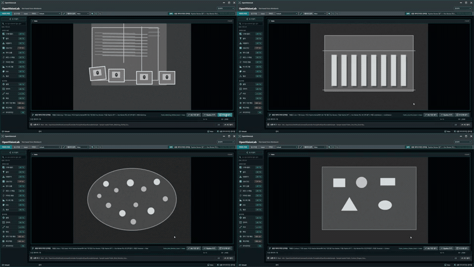
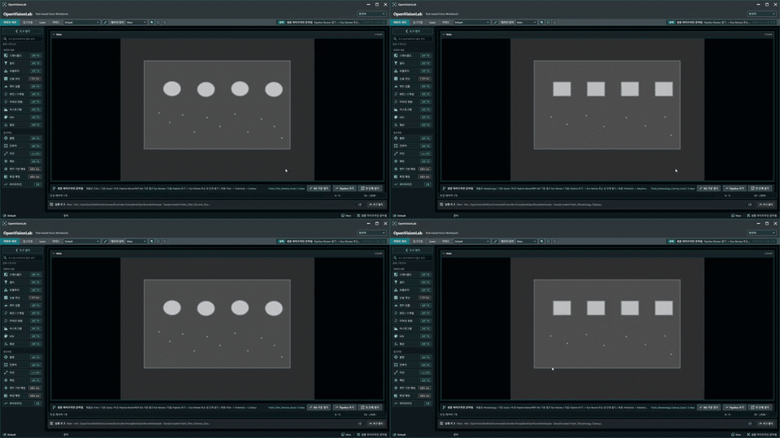
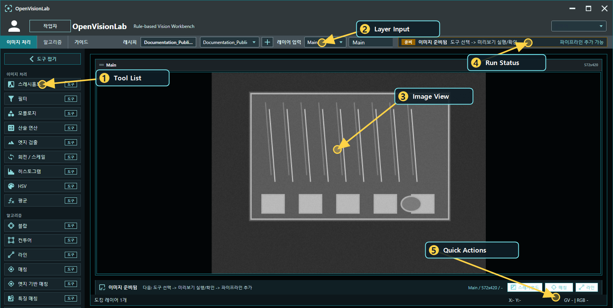
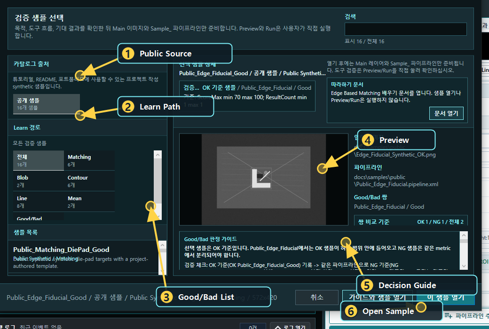
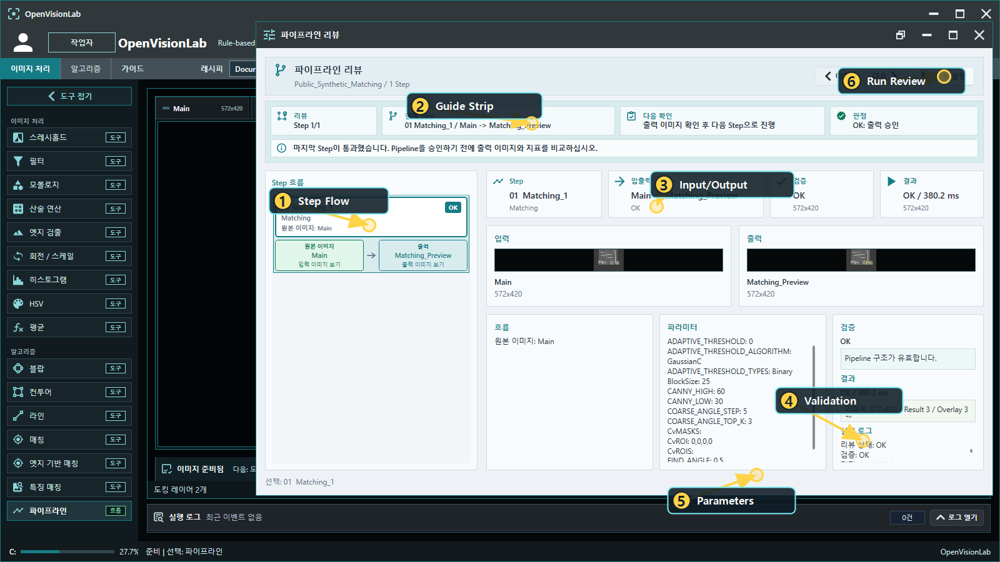

# OpenVisionLab

OpenVisionLab is an **OpenCvSharp 4 rule-based machine vision workbench**.

It lets users build inspection sequences, adjust tool parameters, and review
the images and measurements behind each OK/NG decision.

## Quick Overview

OpenVisionLab is a Windows desktop application for building and validating
rule-based inspection recipes from image samples.

- Workflow: load an image -> select a Layer -> configure a Tool -> run Preview
  or Run -> save the Pipeline/Recipe -> validate with Good and Bad samples
- Main tools: Threshold, Filter, Morphology, Blob, Contour, Matching,
  FeatureMatching, EdgeBasedMatching, Line/Length, and Mean
- Current focus: PropertyGrid-based Tool Views, Pipeline Review, intermediate
  Layer comparison, public samples, and multi-image validation
- LLM/XML assistance is optional and is not required to use the application

## Tool Views in the Current EXE

The following recording shows the main Tool Views running in the current Debug
build. The four panels cover Matching, Line, Blob, and Contour.



[Watch the Tool View MP4](docs/assets/demo/openvisionlab_tool_views_actual_exe.mp4)

- Top left: configure a Matching template and review detections
- Top right: detect a Line, measure a distance, and inspect an intersection
- Bottom left: configure Blob parameters and review the Preview result
- Bottom right: configure Contour parameters and review the Preview result

Each result is produced by configuring the Tool View and explicitly selecting
Preview.

## Chained Processing

OpenVisionLab can connect preprocessing and detection tools in a Pipeline. The
recording below shows Filter and Morphology in their Tool Views, followed by
two three-step Pipelines:

- `Filter -> Threshold -> Contour`
- `Threshold -> Morphology -> Contour`



[Watch the chained-processing MP4](docs/assets/demo/openvisionlab_preprocess_chains_actual_exe.mp4)

Pipeline Review lets users select each Step, inspect its intermediate image,
and review the detected objects and drawings from the final Step.

Preview and Run are always explicit user actions. These recordings use public
example images to demonstrate the workflow; production use requires validation
with representative application data.

## Requirements and Running the Application

Requirements:

- Windows development environment
- .NET SDK 8.0.x (`global.json` currently pins `8.0.421`)
- WPF/Windows Desktop build support
- Runtime DLLs included in the repository's `dll/` directory

From the repository root:

```powershell
dotnet build "OpenVisionLab.sln" -c Debug -p:Platform="Any CPU"
.\bin\Debug\OpenVisionLab.exe
```



The numbered areas in the main workspace are:

1. `Tool List`: select the Tool to configure.
2. `Layer Input`: select or confirm the Layer used as the Tool input.
3. `Image View`: inspect the source image, intermediate images, and results.
4. `Run Status`: review the current Tool state and execution status.
5. `Quick Actions`: open a Tool or add a Step to the Pipeline.

## Product Scope

OpenVisionLab is designed for teaching, tuning, and validating image inspection
rules.

Common problems when building a rule-based inspection include:

- losing track of whether the displayed image is the source or an intermediate
  result;
- not knowing whether one Tool's output is connected to the intended next Tool;
- seeing Score, Count, or Area values without understanding the OK/NG decision;
- getting different results between Preview and a saved Recipe;
- spending too much time repeating the same checks on Good and Bad samples.

OpenVisionLab connects Layer, Tool, Pipeline, Recipe, Pipeline Review, and
Sample Catalog into one workflow:

```text
Load image
  -> Confirm input Layer
  -> Select a Tool
  -> Configure parameters in the PropertyGrid
  -> Preview / Run
  -> Inspect the output Layer
  -> Add a Pipeline Step
  -> Review measurements and OK/NG status
  -> Save the Recipe XML
  -> Validate with Good and Bad samples
```

## Main Features

| Area | Description |
| --- | --- |
| Main Workspace | Load images, manage Layers, zoom, pan, and inspect pixel values |
| Layer Docking | Compare source, intermediate, and final images in tabs or split views |
| Tool View | Configure Threshold, Filter, Morphology, Blob, Contour, Matching, FeatureMatching, Line, Mean, and other tools |
| PropertyGrid | Edit Tool parameters through a consistent property interface |
| Preview / Run | Generate results only when the user explicitly requests execution |
| Pipeline / Recipe | Connect multiple Tools as ordered Steps and save them as XML |
| Pipeline Review | Inspect Step inputs and outputs, measurements, drawings, logs, and OK/NG reasons |
| Sample Catalog | Browse sample images, baseline Pipelines, expected results, and Good/Bad pairs |
| Good/Bad Pair | Compare normal and defective samples using the same measurements |
| Learn Mode | Open guidance for Matching, Blob, Contour, Threshold, Mean, FeatureMatching, EdgeBasedMatching, and Line |
| Language | Switch between Korean and English |

## Public Samples

The `docs/samples/public` directory contains synthetic examples for learning
the basic workflow. Each sample includes an image, a recommended Pipeline,
measurements to inspect, and a Good/Bad expectation.

The public distribution catalogs are:

- `docs/samples/OpenVisionLab.PublicSampleCatalog.csv`
- `docs/samples/OpenVisionLab.ProductSampleCatalog.csv`

The root `Sample/` directory is reserved for local or third-party data and is
not part of the public sample distribution.



Representative sample pairs:

| Task | Good sample | Bad sample | Measurements |
| --- | --- | --- | --- |
| Locate a target with Matching | `Public_Matching_DiePad_Good` | `Public_Matching_DiePad_NoTarget_Bad` | `ResultCount`, `ScoreMax` |
| Count particles with Blob | `Public_Blob_Particles_Good` | `Public_Blob_Particles_Sparse_Bad` | `ResultCount` |
| Count shapes with Contour | `Public_Contour_Shapes_Good` | `Public_Contour_Shapes_Missing_Bad` | `ResultCount` |
| Segment bright pads with Threshold | `Public_Threshold_BandPads_Good` | `Public_Threshold_BandPads_Missing_Bad` | `ResultCount` |
| Check brightness with Mean | `Public_Mean_Brightness_Good` | `Public_Mean_Brightness_Dark_Bad` | `MeanValueAvg` |
| Compare feature-matching scores | `Public_Feature_Card_Good` | `Public_Feature_Card_Wrong_Bad` | `ScoreMax`, `ResultCount` |
| Compare edge-based shapes | `Public_Edge_Fiducial_Good` | `Public_Edge_Fiducial_Wrong_Bad` | `ScoreMax`, `ResultCount` |
| Measure a distance with Line | `Public_Line_Pins_Good` | `Public_Line_Pins_WidePin_Bad` | `DistanceMmAvg` |

## Tool Architecture

Algorithm Tools use a PropertyGrid-based configuration model:

```text
Tool Property Model
  -> PropertyGrid SelectedObject
  -> Preview / Run
  -> VisionToolResult
  -> Metrics / Overlays / Logs
  -> Pipeline Step XML
```

This keeps Tool configuration and Recipe serialization consistent as new Tools
are added. Users can start with presets such as Basic, Fast, or Precise and then
adjust individual parameters in the PropertyGrid.

## Pipeline Review

Pipeline Review shows the execution order and retained result for each Step.
Users can inspect:

- the input and output Layer for the selected Step;
- connections and branches between Steps;
- the result image and detection drawings;
- measurements such as `ResultCount`, `AreaMax`, `ScoreMax`, and
  `LineAngleAvg`;
- the configured acceptance range and measured value;
- the reason for an OK or NG result;
- the parameters that may need adjustment.



## Build

From the repository root:

```powershell
dotnet build "OpenVisionLab.sln" -c Debug -p:Platform="Any CPU"
```

The Debug executable is generated at:

```powershell
.\bin\Debug\OpenVisionLab.exe
```

## Validation

Run the standard build and readiness checks from the repository root:

```powershell
dotnet build "OpenVisionLab.sln" -c Debug -p:Platform="Any CPU"
dotnet run --project "tools/OpenVisionReadinessCheck/OpenVisionReadinessCheck.csproj" -c Debug -- "$PWD"
powershell -NoProfile -ExecutionPolicy Bypass -File tools\TestExternalReferences.ps1
powershell -NoProfile -ExecutionPolicy Bypass -File tools\TestPublicSampleAssets.ps1
powershell -NoProfile -ExecutionPolicy Bypass -File tools\RunVisionSampleCatalog.ps1 -CatalogPath docs\samples\OpenVisionLab.PublicSampleCatalog.csv -OutputDir artifacts\public_sample_catalog
```

Run a current-source WPF view check:

```powershell
dotnet run --project tools\PipelineViewerScreenshotSmoke\PipelineViewerScreenshotSmoke.csproj -c Debug -- --target wpf_shell_host_recipe_language_controls artifacts\smoke\recipe_language_controls
```

Run an actual-EXE smoke scenario:

```powershell
dotnet build "OpenVisionLab.sln" -c Debug -p:Platform="Any CPU"
.\bin\Debug\OpenVisionLab.exe --smoke recipe-manager-tabs --output artifacts\smoke\recipe_manager_tabs
```

When a visible UI or workflow changes, capture fresh evidence from the current
build. Screenshots from an older build are not evidence of the current UI.

## Continuous Integration

The GitHub Actions workflow is defined in `.github/workflows/ci.yml`.

The Windows CI gate checks:

- solution build;
- readiness contracts;
- external-reference policy;
- public-sample asset policy.

WPF screenshots and actual-EXE UI checks are run locally when the change
requires evidence from the current build.

## Releases

- Change history: [CHANGELOG.md](CHANGELOG.md)
- Release and version policy:
  [docs/OPENVISIONLAB_RELEASE_VERSION_POLICY.md](docs/OPENVISIONLAB_RELEASE_VERSION_POLICY.md)

A release candidate must pass the build, readiness, external-reference, and
public-sample checks, plus any UI or EXE checks required by the change.

## Roadmap

The following documents define the current product direction and development
priorities:

- [Product target and main views](docs/OPENVISIONLAB_PRODUCT_TARGET_AND_MAIN_VIEWS.md)
- [Product identity and roadmap](docs/OPENVISIONLAB_PRODUCT_IDENTITY_AND_ROADMAP.md)
- [Current status and next steps](docs/OPENVISIONLAB_STATUS_AND_NEXT_STEPS.md)
- [Validation Suite and Result Archive design](docs/OPENVISIONLAB_VALIDATION_SUITE_RESULT_ARCHIVE_DESIGN_20260707.md)

New features are selected from reproducible operator problems and representative
inspection data. The current status documents distinguish completed work from
conditional backlog items.

## Scope and Limitations

- LLM/XML assistance is optional and is not part of inspection execution.
- Publicly distributed samples are defined by `docs/samples/public` and the
  catalog CSV files. Local or third-party files under `Sample/` are not public
  distribution assets.
- Results from public examples do not establish production robustness.
- Visible changes must be checked in a current build before they are considered
  complete.

## Documentation

- [Tutorial](docs/OPENVISIONLAB_TUTORIAL.md)
- [Learn Mode guide](docs/learn/README.md)
- [Stable feature contracts](docs/OPENVISIONLAB_STABLE_FEATURE_CONTRACTS.md)
- [Current status and next steps](docs/OPENVISIONLAB_STATUS_AND_NEXT_STEPS.md)
- [Public sample catalog](docs/samples/OpenVisionLab.PublicSampleCatalog.csv)
- [Product sample catalog](docs/samples/OpenVisionLab.ProductSampleCatalog.csv)

## License and Copyright

OpenVisionLab is licensed under the
[Apache License 2.0](LICENSE).

This project includes software developed by Noah Choi.

```text
This project includes software developed by 최노아 (Noah Choi).
Copyright (c) 2026 최노아 (Noah Choi).
```

Commercial use, modification, and redistribution are permitted under the
license terms. Copies or substantial portions of the software must retain the
`LICENSE`, `NOTICE`, copyright, and attribution notices.

## Summary

OpenVisionLab is a rule-based machine vision workbench where users configure
inspection conditions, review intermediate results, and validate Recipes across
multiple images. Public samples provide a starting point, while production use
requires representative data and application-specific validation.
