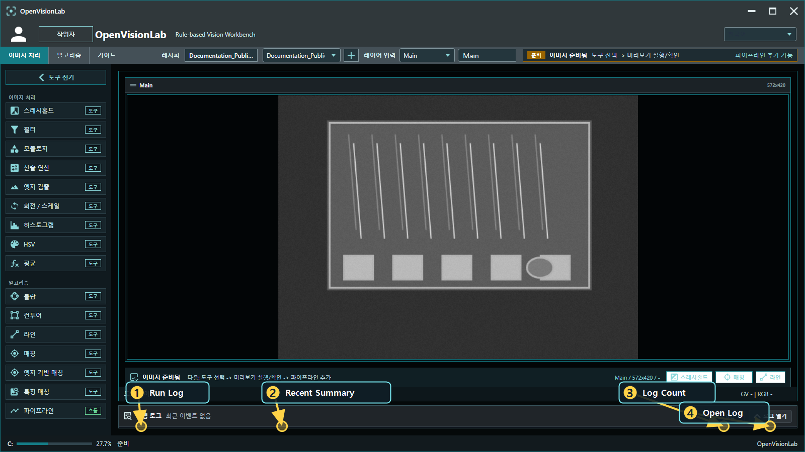
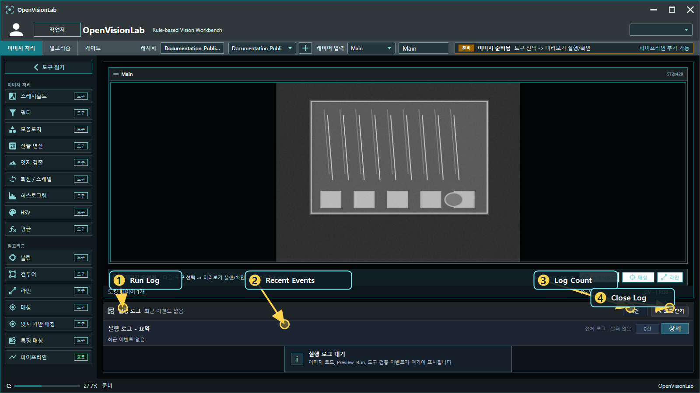
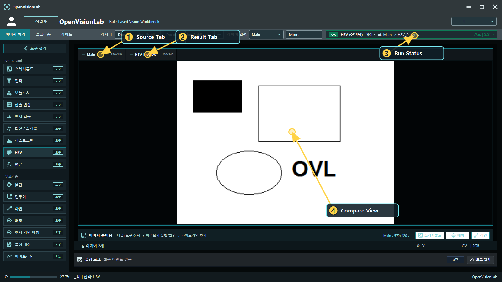

# OpenVisionLab 튜토리얼 가이드

Updated: 2026-07-02

이 문서는 OpenVisionLab을 처음 실행한 사용자가 샘플 이미지를 열고, Tool을 실행하고, Pipeline Review에서 OK/NG 이유를 확인할 수 있도록 정리한 가이드입니다.

OpenVisionLab은 OpenCvSharp4 기반의 룰베이스 비전 검사 워크벤치입니다.
핵심은 “검사가 됐다/안 됐다”에서 끝내는 것이 아니라, 어떤 이미지에서 어떤 Tool을 어떤 순서로 적용했고 어떤 metric 때문에 OK/NG가 되었는지 설명하는 것입니다.

이 문서를 따라 하면 다음 흐름을 익힐 수 있습니다.

```text
샘플 열기
  -> Layer 확인
  -> Tool 선택
  -> Preview 실행
  -> Output Layer 확인
  -> Pipeline Review 실행
  -> Good/Bad 샘플로 기준 확인
```

## 1. 화면 구성 보기

프로그램을 처음 열면 왼쪽에는 Tool 목록, 가운데에는 이미지 workspace, 상단에는 Layer와 실행 상태 영역이 보입니다.


위 화면은 다음 순서로 보면 됩니다.

1. `Tool List`: 사용할 Tool을 선택합니다.
2. `Layer Input`: 현재 기준 Layer가 무엇인지 확인합니다.
3. `Image View`: 실제 이미지를 보고 zoom/pan으로 검사 위치를 확인합니다.
4. `Run Status`: 선택한 Tool의 상태와 예상 output 경로를 봅니다.
5. `Quick Actions`: 현재 Layer에서 바로 실행할 수 있는 주요 Tool과 Pipeline 추가 흐름을 확인합니다.

실행 로그는 기본적으로 접힌 상태로 둡니다.
최근 상태만 보고 작업 공간을 넓게 쓰다가, 실패 원인이나 실행 이력이 필요할 때만 `로그 열기`로 펼쳐서 확인합니다.



1. `Run Log`: 실행 이벤트를 모아 보는 영역입니다.
2. `Recent Summary`: 최근 이벤트의 요약을 접힌 상태에서도 확인합니다.
3. `Log Count`: 현재 표시되는 로그 개수를 확인합니다.
4. `Open Log`: 상세 로그가 필요할 때만 펼칩니다.



1. `Run Log`: 상세 실행 로그가 열린 상태입니다.
2. `Recent Events`: 이미지 로드, Preview, Run, Tool 검증 이벤트를 확인합니다.
3. `Log Count`: 필터링된 로그 개수를 봅니다.
4. `Close Log`: 확인이 끝나면 다시 접어서 workspace를 넓게 씁니다.

처음에는 직접 이미지를 고르기보다 공개용 샘플로 시작하는 편이 좋습니다.
샘플에는 이미지, 추천 Pipeline, expected metric, Good/Bad 기준이 같이 들어 있어서 어떤 결과가 정상인지 바로 확인할 수 있습니다.

## 2. 샘플로 시작하기

Sample Catalog는 OpenVisionLab의 학습과 검증 기준입니다.
공개 튜토리얼에서는 `docs/samples/public` 아래의 synthetic 샘플을 사용합니다.

현재 공개 catalog는 `docs/samples/OpenVisionLab.PublicSampleCatalog.csv`입니다.
8개 Tool 흐름마다 Good/Bad pair를 가지고 있어서, 같은 Pipeline으로 정상 OK와 controlled NG 사유를 함께 확인할 수 있습니다.

| 배우고 싶은 내용 | Good 샘플 | Bad 샘플 | 보는 metric |
| --- | --- | --- | --- |
| Matching으로 대상 찾기 | `Public_Matching_DiePad_Good` | `Public_Matching_DiePad_NoTarget_Bad` | `ResultCount`, `ScoreMax` |
| Blob으로 여러 입자 세기 | `Public_Blob_Particles_Good` | `Public_Blob_Particles_Sparse_Bad` | `ResultCount` |
| Contour로 모양 개수 보기 | `Public_Contour_Shapes_Good` | `Public_Contour_Shapes_Missing_Bad` | `ResultCount` |
| Threshold로 밝은 pad 분리 | `Public_Threshold_BandPads_Good` | `Public_Threshold_BandPads_Missing_Bad` | `ResultCount` |
| Mean으로 밝기 drift 보기 | `Public_Mean_Brightness_Good` | `Public_Mean_Brightness_Dark_Bad` | `MeanValueAvg` |
| FeatureMatching 점수 비교 | `Public_Feature_Card_Good` | `Public_Feature_Card_Wrong_Bad` | `ScoreMax`, `ResultCount` |
| EdgeBasedMatching 형상 비교 | `Public_Edge_Fiducial_Good` | `Public_Edge_Fiducial_Wrong_Bad` | `ScoreMax`, `ResultCount` |
| LineGauge로 거리 보기 | `Public_Line_Pins_Good` | `Public_Line_Pins_WidePin_Bad` | `DistanceMmAvg` |


Sample Catalog 화면은 다음 순서로 봅니다.

1. `Public Source`: 공개 튜토리얼에서 사용할 수 있는 샘플 기준입니다.
2. `Learn Path`: Matching, Blob, LineGauge, Good/Bad 비교처럼 처음 볼 흐름을 좁힙니다.
3. `Good/Bad List`: 같은 Pipeline으로 비교할 정상/불량 샘플을 고릅니다.
4. `Preview`: 선택한 샘플 이미지를 먼저 확인합니다.
5. `Decision Guide`: 어떤 metric으로 OK/NG를 볼지 확인합니다.
6. `Open Sample`: 샘플과 권장 Pipeline을 현재 workspace에 엽니다.

샘플을 열었다고 바로 Preview/Run이 실행되는 것은 아닙니다.
Tool Preview나 Pipeline Review는 사용자가 직접 실행해야 결과가 계산됩니다.

툴별로 따라 할 때는 아래 Learn 문서를 먼저 보는 것이 좋습니다.

- [Matching 배우기](learn/LEARN_MATCHING.md)
- [Blob으로 입자 세기](learn/LEARN_BLOB.md)
- [Contour로 모양 개수 보기](learn/LEARN_CONTOUR.md)
- [Threshold로 밝은 영역 분리](learn/LEARN_THRESHOLD.md)
- [Mean으로 밝기 drift 보기](learn/LEARN_MEAN.md)
- [FeatureMatching 점수 비교](learn/LEARN_FEATURE_MATCHING.md)
- [EdgeBasedMatching 형상 비교](learn/LEARN_EDGE_BASED_MATCHING.md)
- [LineGauge로 거리 보기](learn/LEARN_LINE.md)

## 3. Matching 샘플 따라 하기

처음에는 Matching 샘플이 전체 흐름을 이해하기 쉽습니다.

1. Sample Catalog에서 `Public_Matching_DiePad_Good`를 선택합니다.
2. 샘플을 열어 `Main` Layer에 이미지가 들어왔는지 확인합니다.
3. Tool List에서 `매칭`을 선택합니다.
4. Input Layer가 `Main`인지 확인합니다.
5. Output Layer를 `Matching_Preview`처럼 원본과 다른 이름으로 둡니다.
6. Template 준비 상태를 확인합니다.
7. `미리보기 실행`을 눌러 결과를 만듭니다.
8. Output Layer와 overlay box가 실제 대상 위에 붙었는지 확인합니다.
9. 괜찮으면 Pipeline Step으로 추가합니다.
10. Pipeline Review에서 `리뷰 실행`을 눌러 같은 결과가 재현되는지 확인합니다.


Matching은 Score만 높다고 좋은 결과가 아닙니다.
아래처럼 실제 Preview 결과에서 overlay box와 중심점이 대상 위에 붙는지 봐야 “정확히 잡혔다”고 판단할 수 있습니다.


확인할 metric:

- `ScoreMax`
- `ResultCount`
- Center / Box / Angle

## 4. Tool View 공통 사용법

Tool View는 대체로 다음 구조를 가집니다.

```text
Input Layer
Output Layer
Input Preview
Output Preview
PropertyGrid
Preset / Result Explanation
Preview / Run / Add Pipeline
```

사용 순서는 다음과 같습니다.

1. `Input Layer`를 확인합니다. 처음에는 보통 `Main`입니다.
2. `Output Layer`를 정합니다. 원본과 같은 이름을 쓰지 않는 것이 좋습니다.
3. PropertyGrid에서 파라미터를 조정합니다.
4. 필요한 경우 Basic/Fast/Precise 같은 preset을 적용합니다.
5. `Preview` 또는 `Run`을 명시적으로 실행합니다.
6. Output Preview와 result explanation을 확인합니다.
7. 괜찮으면 Pipeline Step으로 추가합니다.

PropertyGrid는 OpenVisionLab Tool 구조의 핵심입니다.
Tool마다 별도의 임시 UI를 만드는 대신, Tool 모델의 property를 그대로 보여주고 저장합니다.
이 구조 덕분에 UI에서 조정한 값이 Recipe XML과 샘플 검증 흐름으로 이어집니다.

## 5. Layer를 보고 이해하기

OpenVisionLab은 한 장의 이미지만 보는 프로그램이 아닙니다.
원본, 전처리 결과, 최종 검출 결과를 각각 Layer로 나누어 비교합니다.

기본 흐름은 다음과 같습니다.

```text
Main
  -> Binary
  -> Clean
  -> Contour / Blob / Match / Line
  -> Review Result
```

Layer 이름은 가능한 한 역할이 보이게 짓는 것이 좋습니다.

| 목적 | 예시 이름 |
| --- | --- |
| 원본 | `Main` |
| 이진화 결과 | `Pin_Binary`, `Text_Binary`, `FilmSpot_Binary` |
| 노이즈 정리 | `Pin_Clean`, `Text_Clean`, `FilmSpot_Clean` |
| 최종 검출 | `PinShaft_Contour`, `BlobPair_Result`, `Feature_Result` |
| 최종 확인 | `Review`, `Final_Result`, `Overlay` |

Layer Docking을 사용하면 원본과 결과를 나란히 놓고 볼 수 있습니다.



검사 결과가 이상하면 최종 결과만 보지 말고, 바로 이전 Layer를 같이 봐야 합니다.
Threshold가 잘못된 것인지, Morphology에서 객체가 붙어버린 것인지, 마지막 검출 조건이 너무 빡빡한 것인지 단계별로 확인할 수 있습니다.

## 6. Tool별 확인 포인트

### Threshold

Threshold는 전처리의 시작점입니다.

확인할 것:

- 대상과 배경이 잘 분리되는가
- 너무 많은 배경 noise가 남지 않는가
- 다음 Morphology나 Blob/Contour가 읽기 좋은 결과인가

### Blob

Blob은 연결된 객체를 세고, 면적이나 box 크기를 확인할 때 사용합니다.


확인할 metric:

- `ResultCount`
- `AreaMax`, `AreaAvg`
- `BoundsWidthAvg`, `BoundsWidthMax`

### Contour

Contour는 객체 외곽, 문자, 결함 후보를 찾을 때 사용합니다.

확인할 것:

- 실제 대상에 box/overlay가 붙는가
- ROI 전체가 통째로 잡히지 않는가
- `MIN_AREA`, `MAX_AREA`가 너무 넓거나 좁지 않은가

### Pattern Matching / FeatureMatching

Matching 계열은 기준 template과 비슷한 대상을 찾는 데 사용합니다.
Template, detected crop, overlay box를 같이 봐야 합니다.

### EdgeDetection

EdgeDetection은 Canny 같은 edge image를 만들고, LineGauge나 surface defect 검사에 넘기는 전처리 Tool입니다.

확인할 것:

- 필요한 경계가 충분히 남는가
- 배경 noise가 과하지 않은가
- 이후 LineGauge나 Contour가 읽기 좋은 edge image인가

### LineGauge

LineGauge는 edge, 거리, 교차점, 각도 확인에 사용합니다.


확인할 것:

- ROI가 필요한 edge만 포함하는가
- polarity와 scan direction이 맞는가
- `LineAngleAvg`, `LineLengthMax`, `DistanceMmAvg` 같은 metric이 안정적인가

## 7. Pipeline 만들기

Pipeline은 Tool을 순서대로 연결한 검사 Recipe입니다.

가장 기본적인 흐름:

```text
01 Threshold: Main -> Text_Binary
02 Morphology: Text_Binary -> Text_Clean
03 Contour: Text_Clean -> Text_Contour
```

의도적인 branch 예시:

```text
01 Threshold: Main -> Text_Binary
02 Morphology: Text_Binary -> Text_Clean
03 Matching: Main -> Matching_Result
04 Contour: Text_Clean -> Text_Contour
```

Branch는 잘못된 것이 아닙니다.
다만 사용자가 왜 다시 `Main`을 읽는지 이해할 수 있어야 합니다.
Pipeline Review에서 input/output layer를 꼭 확인해야 합니다.

## 8. Pipeline Review에서 결과 보기

Pipeline Review는 Recipe가 실제로 제대로 동작하는지 확인하는 화면입니다.

여기서 확인할 것:

1. Step 흐름이 의도한 순서인가
2. 각 Step의 input/output layer가 맞는가
3. Preview가 아니라 실제 Review 실행 결과인가
4. OK/NG가 어떤 metric 기준으로 결정되었는가
5. NG라면 어느 Step에서 왜 실패했는가


Pipeline Review는 아래 번호 순서로 확인합니다.

1. `Step Flow`: Tool이 어떤 순서로 연결되었는지 봅니다.
2. `Guide Strip`: 현재 단계에서 무엇을 확인해야 하는지 안내를 봅니다.
3. `Input/Output`: 현재 Step이 읽고 쓰는 Layer가 맞는지 확인합니다.
4. `Validation`: OK/NG 기준과 통과 여부를 봅니다.
5. `Parameters`: 실제 실행에 사용된 Tool 파라미터를 확인합니다.
6. `Run Review`: Review 실행은 사용자가 명시적으로 선택합니다.

예시:

```text
NG 원인: Result Count
측정값: 28
목표: 120 - 170
해석: 검출은 되었지만 정상 particle density보다 너무 적음
먼저 볼 것: Threshold, ROI, MIN_AREA/MAX_AREA
```

이런 식으로 결과를 해석할 수 있어야 실제 검사 Recipe로 쓸 수 있습니다.

## 9. Good/Bad pair로 기준 잡기

룰베이스 검사는 정상 이미지에서 OK가 나오는 것만으로는 부족합니다.
불량 이미지에서 어떤 metric이 벗어나는지도 같이 확인해야 합니다.

현재 OpenVisionLab은 Good/Bad pair를 카탈로그로 관리합니다.

| Public Pair | Good에서 보는 것 | Bad에서 보는 것 |
| --- | --- | --- |
| Matching die pad | template 대상 3개 검출 | no-target 이미지에서 `ResultCount=0` |
| Blob particles | 입자가 충분히 많이 검출됨 | sparse 이미지에서 `ResultCount`가 낮아짐 |
| Contour shapes | 5개 shape가 검출됨 | missing-shape 이미지에서 `ResultCount=2` |
| Threshold band pads | 밝은 pad 4개가 분리됨 | missing-pad 이미지에서 `ResultCount=1` |
| Mean brightness | 평균 밝기가 정상 band 안에 있음 | dark 이미지에서 `MeanValueAvg`가 낮아짐 |
| Feature card | feature score가 기준 이상 | wrong card에서 `ScoreMax`가 낮아짐 |
| Edge fiducial | edge fiducial이 1개 검출됨 | wrong fiducial에서 `ResultCount=0` |
| Line pins | pin 간격이 정상 범위 | wide-pin 이미지에서 `DistanceMmAvg`가 낮아짐 |

Bad 샘플 중 일부는 controlled NG입니다.
이 경우 Tool은 결과 이미지를 만들 수 있지만, acceptance metric이 기준을 벗어나 Pipeline Review에서 NG로 표시됩니다.

## 10. Recipe 저장과 전환

검증된 Pipeline은 XML Recipe로 저장합니다.

Recipe를 저장하기 전에 최소한 하나의 Good 샘플과 하나의 Bad 샘플로 확인하는 것이 좋습니다.
룰베이스 검사의 신뢰도는 다양한 정상/불량 샘플에서 같은 기준이 반복해서 설명되는지에 달려 있습니다.

Recipe를 바꿀 때는 다음을 확인합니다.

- 전환한 Recipe의 Pipeline이 맞는가
- Tool View와 Pipeline Review가 현재 Recipe context를 기준으로 동작하는가
- Recipe 전환만으로 Preview/Run이 실행되지 않았는가
- Input/Output route가 사용자의 의도와 맞는가

## 11. 문제가 생겼을 때 보는 순서

결과가 이상할 때는 아래 순서로 보는 것이 가장 빠릅니다.

1. 현재 보고 있는 Layer가 맞는가
2. Tool의 Input Layer가 맞는가
3. Output Layer가 비어 있거나 다른 결과로 덮이지 않았는가
4. Preview/Run을 실제로 실행했는가
5. Threshold 결과가 대상과 배경을 잘 나누는가
6. Morphology에서 필요한 객체가 사라지거나 붙지 않았는가
7. Blob/Contour의 area 조건이 너무 좁거나 넓지 않은가
8. Matching template이 너무 크거나 배경을 많이 포함하지 않는가
9. ROI가 너무 넓어 후보가 많아지지 않았는가
10. Pipeline Review의 NG metric과 목표 범위를 확인했는가

## 12. 추천 학습 순서

처음 OpenVisionLab을 익힐 때는 아래 순서가 좋습니다.

1. public synthetic Matching 샘플로 template matching 결과 보기
2. public synthetic Blob 샘플로 Blob count 흐름 보기
3. public synthetic LineGauge 샘플로 ROI와 distance 결과 보기
4. public synthetic Good/Bad pair로 controlled NG 확인
5. 직접 이미지를 불러와 같은 흐름을 적용
6. Pipeline XML 저장
7. Pipeline Review에서 다시 검증

## 13. 정리

OpenVisionLab을 사용할 때는 “이미지를 처리한다”보다 “검사 기준을 만든다”는 관점으로 보는 것이 좋습니다.

좋은 Recipe는 다음 조건을 만족합니다.

- 어떤 Layer를 읽고 쓰는지 명확하다.
- Preview와 실제 반영이 구분된다.
- 결과 이미지와 overlay가 기준 위치를 보여준다.
- OK/NG 이유가 metric으로 설명된다.
- Good/Bad 샘플에서 같은 기준으로 반복 검증된다.
- XML로 저장한 뒤에도 같은 결과가 나온다.

이 흐름이 OpenVisionLab의 핵심입니다.
