# OpenVisionLab Tutorial

Updated: 2026-06-16

OpenVisionLab은 OpenCVSharp 기반의 Rule-based Vision Workbench입니다. 이 튜토리얼은 처음 사용하는 사용자가 이미지 한 장을 불러오고, Tool을 조정하고, Pipeline Recipe로 저장한 뒤, 결과를 검증하는 기본 흐름을 설명합니다.

사용자에게 보여줄 기본 문서는 이미지가 포함된 `OPENVISIONLAB_TUTORIAL.html`입니다. 이 Markdown 문서는 내용 유지보수와 Git diff 확인을 위한 원본 성격으로 둡니다.

## 0. 처음 보는 순서

처음 사용하는 사용자는 모든 기능을 한 번에 보려고 하지 말고 아래 순서로 확인하는 것이 좋습니다.

| 순서 | 화면 | 목적 |
| --- | --- | --- |
| 1 | Main Workspace | 이미지를 불러오고 현재 Layer, 결과, 로그 위치를 이해한다. |
| 2 | Threshold Tool | Input Source와 Output Result를 나누어 전처리 결과를 만든다. |
| 3 | 검사 Form | Contour, Blob, Matching, FeatureMatching, LineGauge 같은 Tool을 단독으로 티칭한다. |
| 4 | Pipeline Form | 티칭한 조건을 Step으로 연결하고 Input/Output 흐름을 확인한다. |
| 5 | Sample Catalog | 샘플 이미지, 추천 Pipeline, 기대 Metric을 함께 열어 기준 결과를 검증한다. |
| 6 | AI Recipe | 이미지와 요구사항으로 생성된 XML을 Import하고 Preview로 검증한다. |

가장 중요한 규칙은 단순합니다.

- `Main`은 기준 원본으로 유지한다.
- Tool 결과는 별도 Output Layer에 만든다.
- Pipeline에서는 이전 Step의 Output을 다음 Step의 Input으로 연결한다.
- Preview는 확인이고 Publish는 Main Workspace 반영이다.

## 1. 기본 개념

OpenVisionLab에서 가장 중요한 개념은 세 가지입니다.

| 개념 | 설명 |
| --- | --- |
| Layer | 원본 이미지나 처리 결과 이미지를 담는 화면 단위입니다. |
| Tool | Threshold, Morphology, Contour, Blob, Line 같은 단일 OpenCV 처리 또는 검사 기능입니다. |
| Pipeline | 여러 Tool Step을 순서대로 연결한 검사 Recipe입니다. XML로 저장하고 다시 실행할 수 있습니다. |

사용자는 항상 다음을 확인해야 합니다.

- 현재 어떤 Layer를 보고 있는가?
- 현재 Step은 어떤 Input Layer를 읽는가?
- 현재 Step은 어떤 Output Layer를 만드는가?
- Run Preview인지, Publish Result인지?
- 결과가 OK인지 NG인지, 그 이유는 무엇인지?

## 2. 이미지 불러오기

1. Main Workspace를 연다.
2. Main 레이어에 이미지를 불러온다.
3. 오른쪽 `레이어 / 결과` 영역에서 Main 레이어와 이미지 크기를 확인한다.
4. 필요하면 새 레이어를 만든다.
5. 상단 상태바에서 활성 레이어와 입력 기준을 확인한다.

기대 상태:

- Main 레이어가 기준 이미지로 표시된다.
- 이미지 크기가 오른쪽 레이어 목록에 보인다.
- 하단 로그에는 이미지 로드 또는 레이어 변경 로그가 남는다.

## 2-1. 여러 레이어로 이미지 비교하기

OpenVisionLab은 하나의 이미지만 보는 프로그램이 아니라, 원본과 처리 결과를 여러 레이어로 나누어 비교하는 프로그램입니다.

기본 비교 흐름:

1. `Main` 레이어에는 기준 원본 이미지를 유지한다.
2. Threshold 결과는 `Threshold`, `TextSymbol_Binary`, `Pin_Edge`처럼 별도 Output Layer에 만든다.
3. Morphology 결과는 `Clean`, `Morphology`, `TextSymbol_Clean`처럼 다음 레이어에 만든다.
4. Contour, Blob, LineGauge, Matching 결과는 `*_Contour`, `*_Blob`, `*_Line`, `*_Match`처럼 검출 목적이 드러나는 이름으로 만든다.
5. 오른쪽 `레이어 / 결과` 목록에서 각 레이어를 선택해 원본, 전처리 결과, 최종 검출 결과를 비교한다.

레이어 비교 시 확인할 것:

- 원본 `Main`이 의도 없이 덮어써지지 않았는가?
- Threshold 결과가 검출 대상과 배경을 제대로 분리했는가?
- Morphology 결과에서 노이즈는 줄었지만 필요한 대상이 사라지지 않았는가?
- 최종 검사 결과 레이어에 Overlay, Box, Line, Score, Metric이 남는가?
- Pipeline의 각 Step이 이전 Step Output을 읽는지, 의도적으로 Branch를 만드는지 이해되는가?

권장 레이어 이름:

| 목적 | 예시 |
| --- | --- |
| 원본 | `Main` |
| 이진화 | `Text_Binary`, `Pin_Binary`, `Surface_Binary` |
| 노이즈 정리 | `Text_Clean`, `Pin_Clean`, `Surface_Clean` |
| 최종 검출 | `Text_Contour`, `Pin_Line`, `Part_Blob`, `Mark_Match` |
| 최종 확인 이미지 | `Review`, `Overlay`, `Final_Result` |

중요한 원칙:

- Tool Form에서 테스트할 때도 Input Layer와 Output Layer를 명확히 나눈다.
- Pipeline에서는 Step마다 Input/Output pill을 보고 흐름을 확인한다.
- 사용자가 결과를 비교해야 하는 경우에는 원본, 전처리, 최종 검출 레이어를 모두 남겨둔다.

## 3. Threshold Tool로 전처리하기

Threshold Tool은 가장 기본적인 전처리 도구입니다.

1. `Image Processing` 또는 Tool 메뉴에서 Threshold를 연다.
2. `Input Source`를 선택한다.
3. `Output Result`를 확인한다.
4. 모드를 선택한다.
   - `Basic`: 하나의 기준값으로 foreground/background를 나눈다.
   - `Range`: Min/Max 범위 안의 밝기만 남긴다.
   - `Adaptive`: 조명이 균일하지 않은 이미지에서 지역 밝기 기준으로 나눈다.
5. TrackBar를 조정하며 Preview를 확인한다.
6. 결과가 적절하면 `Add Pipeline Step`을 누른다.

주의:

- Tool Form의 Preview는 지정된 Output Layer에 반영되어야 합니다.
- Main 원본이 의도 없이 덮어써지면 안 됩니다.
- Range/Adaptive 값은 이미지마다 다르므로 Sample Catalog 기준값을 참고합니다.

## 4. Pipeline 만들기

Pipeline은 반복 가능한 검사 Recipe입니다.

권장 기본 흐름:

```text
Main
  -> Threshold
  -> Morphology
  -> Contour / Blob / Line / Matching
  -> Overlay / Metrics
  -> Summary Preview
```

Step 추가 순서:

1. Pipeline Form을 연다.
2. 첫 Step으로 Threshold를 추가한다.
3. 두 번째 Step으로 Morphology를 추가한다.
4. 세 번째 Step으로 Contour 또는 Blob을 추가한다.
5. 각 Step의 Input/Output pill을 확인한다.

정상 체인 예:

```text
01 Threshold: Main -> Text_Binary
02 Morphology: Text_Binary -> Text_Clean
03 Contour: Text_Clean -> Text_Contour
```

Branch 예:

```text
01 Threshold: Main -> Text_Binary
02 Morphology: Text_Binary -> Text_Clean
03 Contour: Main -> Text_Contour
```

세 번째 Step이 다시 Main을 읽으면 Branch입니다. Branch가 항상 나쁜 것은 아니지만, 사용자가 의도했는지 확인해야 합니다.

## 5. Preview와 Publish 구분

Pipeline Form에서 가장 중요한 UX 규칙입니다.

| 동작 | 의미 |
| --- | --- |
| Run Preview | Pipeline Form 내부에서 결과를 미리 계산합니다. Main Workspace를 자동으로 덮어쓰지 않습니다. |
| Publish Result | Preview 결과를 Main Workspace의 결과 Layer로 명시적으로 내보냅니다. |

권장 사용 순서:

1. Run Preview를 누른다.
2. Step별 결과와 Summary Preview를 확인한다.
3. Metrics와 Overlay를 확인한다.
4. 결과가 맞으면 Publish Result를 누른다.
5. Main Workspace에서 결과 Layer를 확인한다.

## 6. 결과 판단하기

OpenVisionLab은 단순히 이미지가 보이는 것보다 결과 판단 근거를 중요하게 다룹니다.

확인할 항목:

- `Status`: OK / NG / Error / Needs Preview
- `Metrics`: ResultCount, Area, BoundsWidth, LineLength, Score 등
- `Overlay`: 검출 위치, 박스, 선, 점
- `Message`: 실패 또는 성공 요약
- `DiagnosticHint`: 왜 실패했는지
- `SuggestedFix`: 무엇을 수정해야 하는지

예:

```text
Status: NG
ErrorCode: ThresholdInvalidRange
DiagnosticHint: RangeMin is greater than RangeMax.
SuggestedFix: Set RangeMin lower than RangeMax.
```

## 7. Sample Catalog 사용하기

Sample Catalog는 OpenVisionLab을 학습하고 검증하는 기준입니다.

1. Pipeline Form에서 Samples를 연다.
2. Recipe Catalog를 선택한다.
3. Required Sample을 선택한다.
4. Open + Preview를 실행한다.
5. Expected Metric과 Actual Metric을 비교한다.

Sample Catalog가 좋은 이유:

- 어떤 이미지에 어떤 Pipeline이 적절한지 확인할 수 있다.
- 기대 ResultCount, Area, BoundsWidth 같은 기준값이 있다.
- LLM Recipe가 참고할 수 있는 안정적인 예제가 된다.
- 내부 개발 중 기능 회귀를 빠르게 찾을 수 있다.

## 8. AI Recipe 사용 흐름

AI Recipe는 최종 결정자가 아니라 Recipe Assistant입니다.

권장 흐름:

```text
사용자 이미지 + 검사 목표
  -> LLM이 Pipeline XML 제안
  -> OpenVisionLab에서 Import
  -> XML Validation
  -> Run Preview
  -> 실패 Step 확인
  -> 파라미터 또는 Layer Flow 수정
  -> 다시 Preview
  -> 최종 승인 후 Save
```

AI Recipe에서 반드시 확인할 것:

- 마지막 결과가 하나의 review image로 합쳐지는가?
- Branch가 의도적인가?
- 실패 Step만 수정해도 되는가?
- 성공한 이전 Step을 불필요하게 바꾸지 않았는가?

## 9. Tool별 테스트 가이드

각 Tool은 단독으로 파라미터를 이해한 뒤 Pipeline Step으로 연결해서 검증하는 방식이 가장 안전합니다.

### 검사 폼 기반 티칭 공통 흐름

각 검사 폼은 “파라미터를 찾는 공간”입니다. 처음부터 Pipeline XML만 수정하는 것보다, 검사 폼에서 실제 이미지와 레이어를 보면서 티칭한 뒤 Pipeline Step으로 넘기는 흐름이 사용자에게 더 직관적입니다.

공통 티칭 순서:

1. Main Workspace에서 원본 이미지를 `Main` 레이어에 불러온다.
2. 검사 폼을 연다. 예: Threshold, Contour, Blob, Matching, EdgeDetection, LineGauge.
3. 검사 폼의 `Input Layer`를 선택한다.
   - 첫 전처리는 보통 `Main`.
   - 두 번째 이후 검사는 이전 Output Layer를 선택한다.
4. 검사 폼의 `Output Layer`를 지정한다.
   - 원본과 비교할 수 있도록 Input과 다른 이름을 사용한다.
5. ROI가 필요하면 먼저 ROI를 잡는다.
6. TrackBar, ComboBox, Numeric 설정을 바꾸며 Preview를 확인한다.
7. 검출 Overlay와 Metric이 기대 수준이면 Pipeline Step으로 추가한다.
8. Main Workspace 또는 Pipeline Preview에서 Input/Output 레이어를 다시 비교한다.

검출이 됐다고 판단하는 기준:

- 결과 이미지에 대상 위치가 명확히 표시된다.
- Box, Line, Cross, Label 같은 Overlay가 실제 대상 위에 올라간다.
- `ResultCount`, `Area`, `Score`, `LineLength`, `Angle`, `BoundsWidth` 같은 Metric이 기대 범위에 있다.
- 로그에 ErrorCode가 없고 ResultStatus가 OK/Passed 흐름으로 남는다.
- 같은 설정을 Pipeline Run Preview에서도 실행했을 때 같은 결과가 나온다.

검사 폼에서 Pipeline으로 넘길 때 주의할 점:

- 검사 폼에서 잘 보였던 Output Layer 이름을 Pipeline Step에도 그대로 쓰는 것이 좋다.
- Contour/Blob/LineGauge 같은 검사 폼 내부에 Threshold 옵션이 켜져 있다면, 별도 Threshold Step을 이미 사용 중인지 확인한다.
- 별도 Threshold/Morphology Step이 있다면 검사 Tool 내부 Threshold는 끄는 편이 흐름을 이해하기 쉽다.
- 반대로 단일 Tool만 빠르게 테스트하려는 경우에는 내부 Threshold 옵션을 사용할 수 있다.

| Tool | 추천 샘플 | 기본 테스트 흐름 | 확인할 Metric / Overlay |
| --- | --- | --- | --- |
| Contour | `Contour_TextSymbols`, `DiePad_Surface` | `Main -> Threshold -> Morphology -> Contour` | `ResultCount`, `AreaMin/Max/Avg`, Object Box Overlay |
| Blob | `Rice_Particle_Blob` | `Main -> Threshold -> Morphology -> Blob` | `ResultCount`, `BoundsWidthAvg`, `AreaAvg` |
| Pattern Matching | `Contour_TemplateMatching` | `Main -> Matching` 또는 ROI 지정 후 Matching | `ScoreMax`, `ResultCount`, Match Box Overlay |
| FeatureMatching | `Feature_TemplateReview` | `Main -> FeatureMatching` | `ScoreMax`, `ResultCount`, Homography Box Overlay, Detected Crop |
| EdgeDetection | `Pins_LineGauge`, `SurfaceDefect_Edge` | `Main -> Filter -> EdgeDetection` | Edge 이미지 연결성, 배경 노이즈 |
| LineGauge | `Pins_LineGauge` | `Main -> Filter -> EdgeDetection -> LineGauge` | `EdgeCount`, `LineLengthMax`, `LineLengthMmMax`, `LineAngleAvg`, Fit Line Overlay |
| 거리 / 치수 측정 | `BentPin_GoodShaft`, `BentPin_BadShaft`, `Pins_LineGauge` | Contour/Blob/LineGauge 결과에서 폭, 높이, 길이, 각도, Edge 간격 비교 | `BoundsWidthMax`, `BoundsWidthMmMax`, `BoundsHeightMmMax`, `LineLengthMmMax`, `LineAngleAvg`, `PIXELPERMM` |

### 검사 폼과 검출 결과 예시

검사 폼은 파라미터를 찾는 곳이고, Sample/Pipeline Preview는 그 파라미터가 실제 검출로 이어지는지 확인하는 곳입니다. 아래 검사 폼 이미지는 좌측 Input/Output 이미지와 우측 Property를 함께 보여주는 전체 Form 기준입니다.

#### Contour

- 폼에서 볼 것: Input 이미지, Output 이미지, Input/Output Layer, Threshold, ROI, Area 조건.
- 결과에서 볼 것: 전체 영역이 아니라 문자/숫자/도형 단위로 Overlay가 올라오는지.

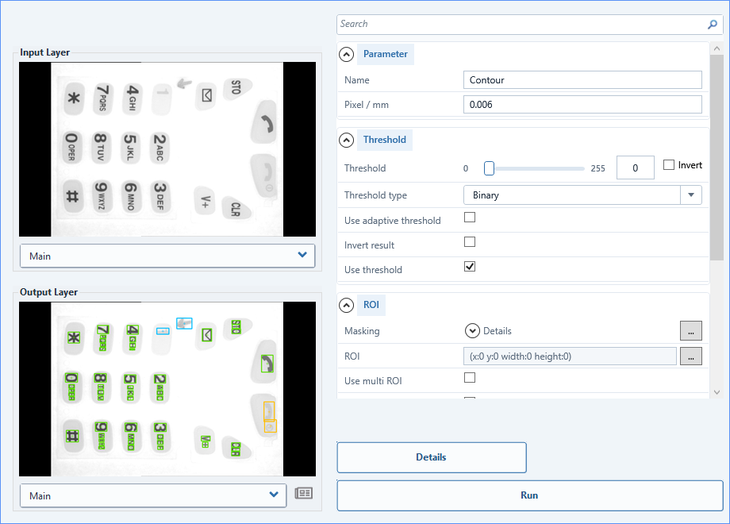
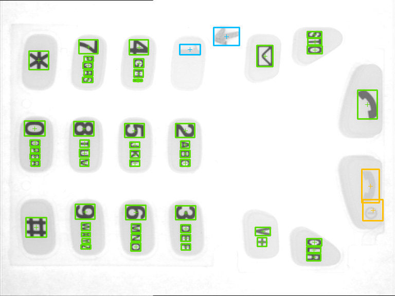

#### Blob

- 폼에서 볼 것: Input 이미지, Output 이미지, Threshold, ROI, Blob 조건.
- 결과에서 볼 것: 이진화된 객체가 붙거나 끊기지 않고 Count와 Area 기준이 안정적인지.

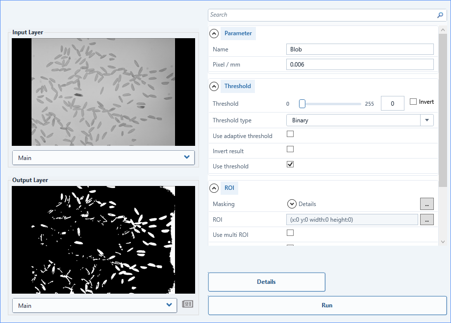
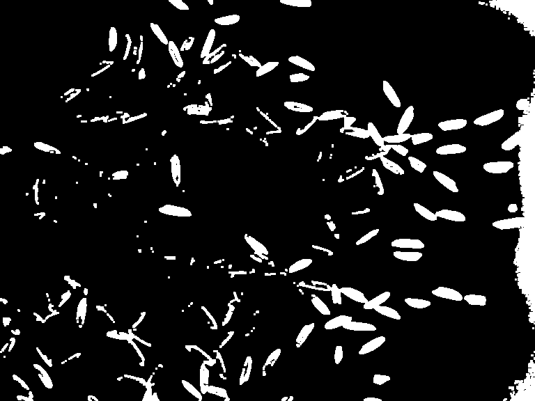

#### Pattern Matching

- 폼에서 볼 것: Input 이미지, Output 이미지, 기준 패턴, 검출 Crop, ROI, Score 기준.
- 기준 패턴은 찾으려는 형상만 타이트하게 crop한다. 넓은 배경이나 주변 버튼이 포함되면 사용자가 오검출로 판단하기 쉽다.
- 결과에서 볼 것: Template과 Detected crop이 같은 대상인지, Overlay 박스와 중심점이 실제 대상 위에 올라오는지.
- 박스만 보면 맞는 위치도 오검출처럼 보일 수 있으므로 Template, Detected crop, Overlay result를 함께 확인한다.

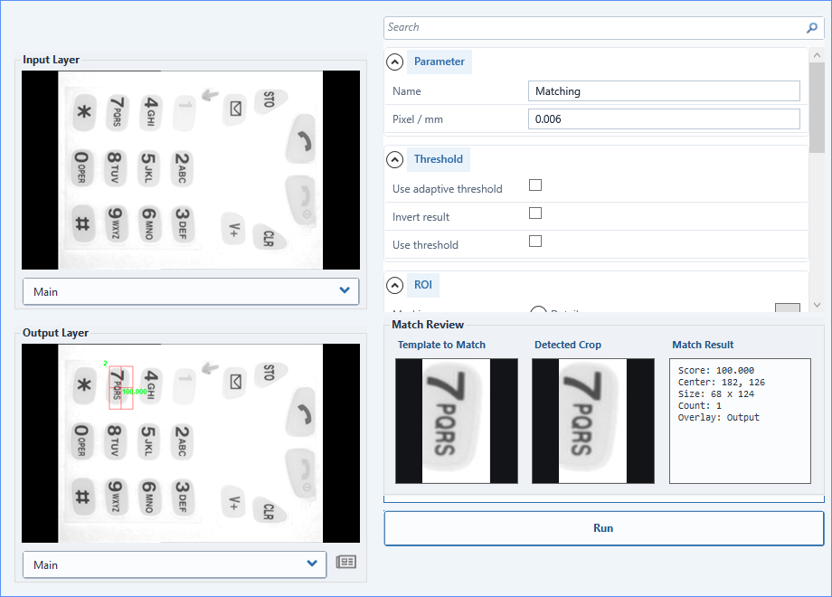

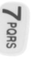
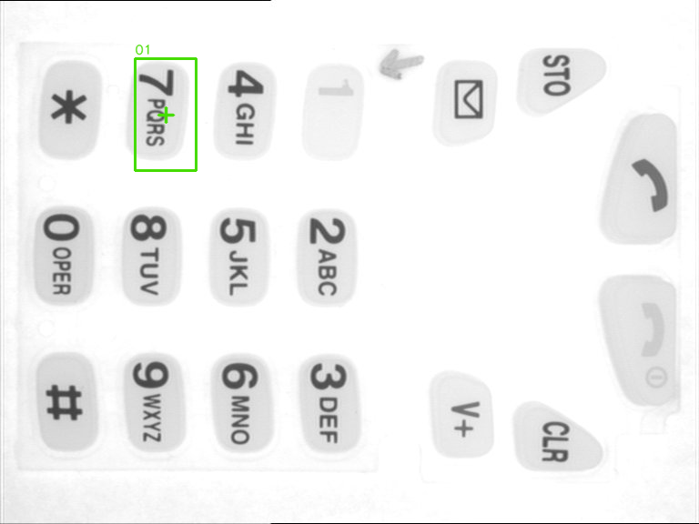
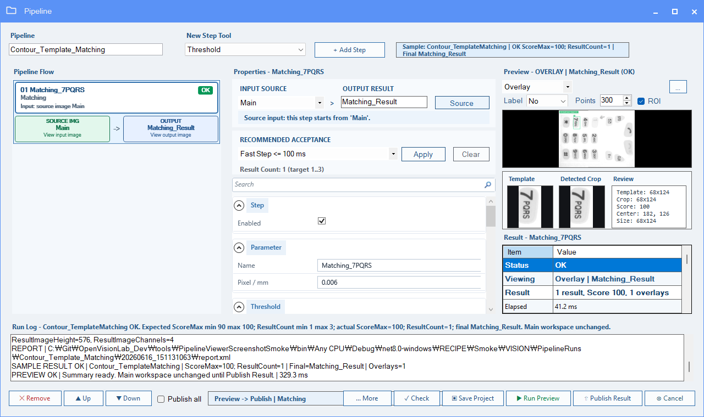

Pipeline Matching Review에서는 Run Preview 후 선택한 Matching Step의 Template, Detected crop, Score, Center, Size를 한 화면에서 확인한다. 작은 Template/Crop 이미지는 더블클릭해서 확대 뷰어로 다시 확인할 수 있다.

#### FeatureMatching

- 폼에서 볼 것: Input 이미지, Output 이미지, 기준 feature template, 검출 Crop, ROI, Score 기준, RANSAC 조건.
- 결과에서 볼 것: Template과 Detected crop이 같은 특징 패턴인지, Homography Box와 중심점이 실제 대상 위에 올라오는지.
- 회전, 스케일, 원근 변화가 있는 대상은 단순 Matching보다 FeatureMatching 결과가 더 안정적일 수 있다.

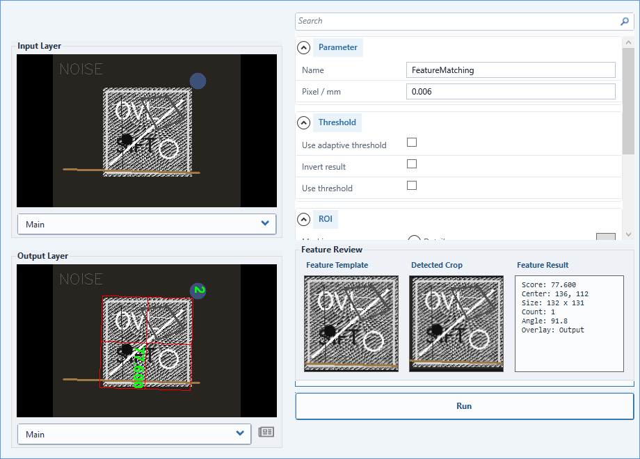
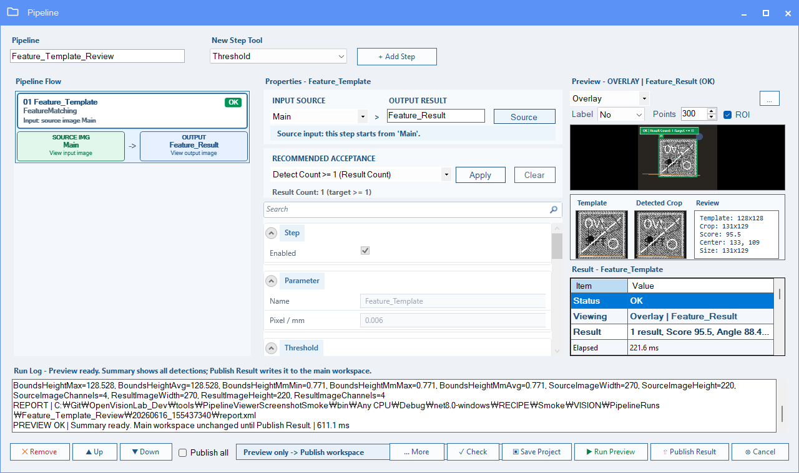
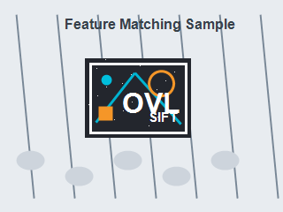
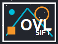
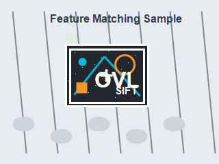

FeatureMatching Form에서는 feature template과 검출 crop을 직접 비교하며 Score, Center, Size, Angle을 확인한다. Pipeline FeatureMatching Review에서는 같은 정보를 Step 결과 기준으로 다시 확인한다. 작은 이미지는 더블클릭해서 확대 뷰어로 다시 확인할 수 있다.

FeatureMatching 샘플 재현 순서:

1. Pipeline Form에서 Samples를 연다.
2. `Feature_TemplateReview`를 선택한다.
3. `Open + Preview` 또는 `Run Preview`를 실행한다.
4. 결과가 `Feature_Result` 레이어에 생성되는지 확인한다.
5. `ScoreMax`, `ResultCount`, Template, Detected crop, Overlay가 같은 대상을 가리키는지 확인한다.

#### EdgeDetection

- 폼에서 볼 것: Input 이미지와 Output Edge 이미지가 함께 보이는지, 후속 LineGauge나 치수 측정에 넘길 Edge가 충분한지.
- 결과에서 볼 것: 필요한 결함 또는 경계만 남고 배경 노이즈가 과도하지 않은지.

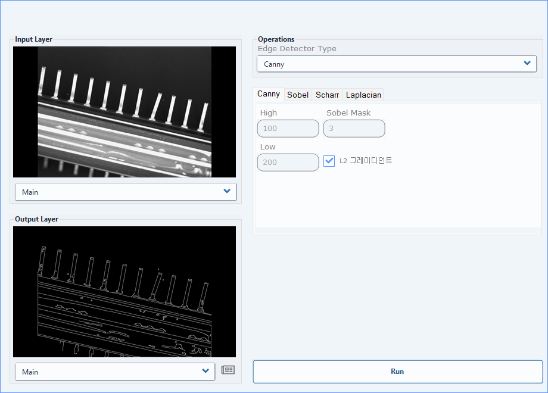
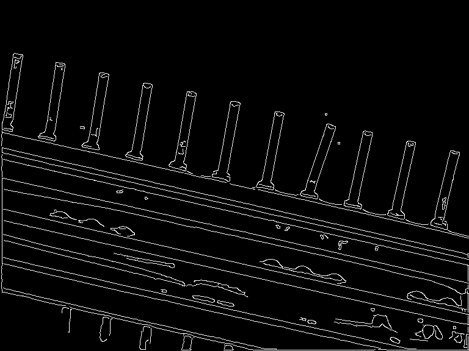

#### LineGauge / 치수 측정

- 폼에서 볼 것: Input 이미지, Output Line/Edge 결과, Edge 방향, Threshold, Pixel/mm, ROI 조건.
- 결과에서 볼 것: Edge 후보가 충분히 남아 직선 길이와 각도 Metric을 신뢰할 수 있는지.

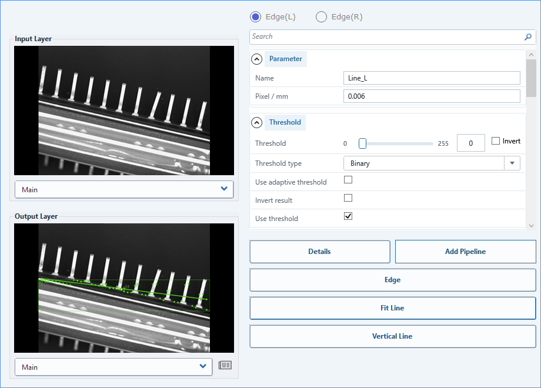
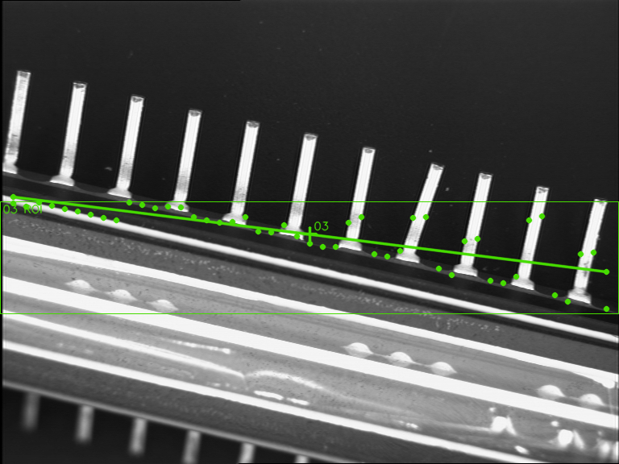

### 수직선 라인을 이용한 거리측정 흐름

거리측정은 단순히 Edge 이미지를 보는 것으로 끝나지 않습니다. 측정 ROI 안에 여러 개의 수직 스캔 라인을 배치하고, 각 라인에서 Edge 후보를 찾은 뒤 Pixel/mm 보정값으로 실제 치수 Metric을 계산해야 합니다.

1. `Pixel/mm` 값을 먼저 확인한다.
   - 보정값이 틀리면 mm 단위 결과도 모두 틀어진다.
2. 측정할 영역을 가로지르는 ROI를 지정한다.
3. EdgeDetection 또는 Tool 내부 Threshold로 측정 대상의 경계를 분리한다.
4. ROI 안에 여러 수직 스캔 라인을 만들고, 각 라인에서 위/아래 또는 좌/우 Edge 후보를 찾는다.
5. 노이즈 후보를 제외하고 유효 Edge 포인트만 남긴 뒤 평균 거리, 최대 거리, 최소 거리, 각도 Metric을 계산한다.
6. `LineLengthMmMax`, `BoundsWidthMmMax`, `BoundsHeightMmMax`, `LineAngleAvg` 같은 Metric으로 OK/NG 기준을 만든다.

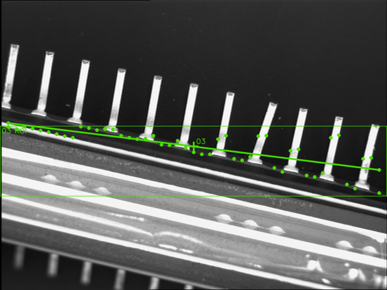

Contour 테스트 순서:

1. Threshold로 대상이 흰색 또는 검정색으로 분리되는지 확인한다.
2. Morphology로 작은 노이즈를 줄이되 대상이 붙어버리지 않는지 확인한다.
3. Contour의 Min/Max Area를 조정해 필요한 도형, 글자, 숫자만 남긴다.
4. Overlay Box가 ROI 전체가 아니라 실제 object 단위로 그려지는지 확인한다.

Blob 테스트 순서:

1. 연결된 객체를 세야 하는 이미지에서 사용한다.
2. Threshold/Morphology 결과가 객체별로 분리되어 있는지 먼저 확인한다.
3. `ResultCount`와 평균 폭/면적 Metric이 기대 범위에 들어오는지 확인한다.

Pattern Matching 테스트 순서:

1. 찾을 기준 패턴 이미지는 대상 형상만 타이트하게 잘라 등록한다.
2. ROI를 좁혀 오검출 가능성을 줄인다.
3. `ScoreMax`가 충분히 높은지 확인하고, 여러 후보가 나오면 Score와 위치를 함께 본다.

Edge / Line / 거리 측정 테스트 순서:

1. Filter로 노이즈를 줄인 뒤 EdgeDetection을 적용한다.
2. LineGauge는 Edge 이미지 또는 원본 이미지에서 scan 방향, polarity, ROI를 조정한다.
3. 거리/치수 측정은 Pixel/mm 보정값을 먼저 확인한 뒤 `BoundsWidthMmMax`, `BoundsHeightMmMax`, `LineLengthMmMax`, 각도 Metric으로 OK/NG 기준을 만든다.

## 10. XML 저장과 외부 실행

검증된 Pipeline은 XML로 저장합니다.

이 XML은 다음 경로에서 재사용되어야 합니다.

- OpenVisionLab Pipeline Form
- Batch Test
- Sample Catalog
- AI Recipe Import
- VisionRecipeRunner
- 외부 DLL/API 호출 구조

즉, UI에서 만든 Recipe는 UI 밖에서도 실행 가능해야 합니다.

## 11. 권장 연습 순서

처음 사용하는 사용자는 아래 순서로 연습하는 것이 좋습니다.

1. `Contour_TextSymbols` 샘플을 연다.
2. Threshold Step의 Input/Output을 확인한다.
3. Morphology Step이 이전 Output을 읽는지 확인한다.
4. Contour Step이 어떤 Layer를 읽는지 확인한다.
5. Run Preview를 실행한다.
6. Summary Preview에서 모든 검출 Overlay를 확인한다.
7. Publish Result를 눌러 Main Workspace에 결과를 보낸다.
8. XML로 저장한다.
9. 저장한 XML을 다시 Load한다.
10. 같은 결과가 나오는지 확인한다.

## 12. 문제가 생겼을 때 보는 순서

1. Step Flow에서 Input Layer가 맞는지 본다.
2. Output Layer가 비어 있거나 이전 Step을 덮어쓰는지 본다.
3. Preview가 실행되었는지 확인한다.
4. Result grid의 Status와 Message를 본다.
5. Run Log의 첫 번째 NG Step을 본다.
6. DiagnosticHint와 SuggestedFix를 확인한다.
7. Sample Catalog의 비슷한 Recipe를 참고한다.

## 13. 핵심 원칙

- Preview는 확인용이고 Publish는 반영용입니다.
- Step은 기본적으로 이전 Output을 읽어야 합니다.
- Branch는 허용되지만 명확히 표시되어야 합니다.
- 최종 검출 결과는 사용자가 한눈에 확인할 수 있어야 합니다.
- 실패는 단순히 NG가 아니라 이유와 수정 방향이 있어야 합니다.
