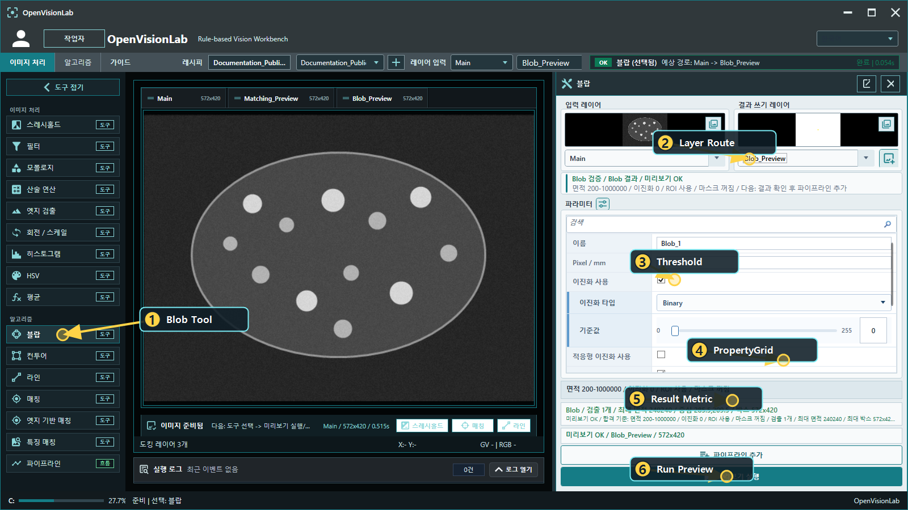
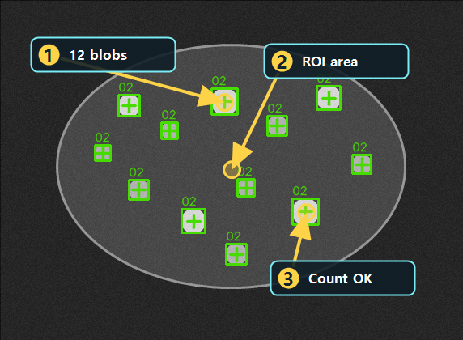

# Blob으로 입자 세기

Updated: 2026-07-02

Blob은 threshold 이후 연결된 객체를 세고, 면적과 box 크기를 확인하는 도구입니다.
OpenVisionLab에서는 Blob 결과를 단순한 개수로만 보지 않고 `ResultCount`, `Area`, `BoundsWidth` 같은 metric으로 설명합니다.

## 사용할 public sample

| 역할 | SampleName | 기준 |
| --- | --- | --- |
| Good | `Public_Blob_Particles_Good` | `ResultCount=8..14` |
| Bad | `Public_Blob_Particles_Sparse_Bad` | `ResultCount=2..4` |

두 샘플은 같은 `Public_Blob_Particles.pipeline.xml`을 사용합니다.
Bad 샘플도 결과 이미지는 만들어질 수 있지만, 정상 count 범위보다 적어서 controlled NG가 됩니다.

## 결과 근거 이미지

아래 이미지는 현재 public catalog runner를 현재 코드 기준으로 실행해 생성한 결과입니다.
ROI 안의 입자 12개가 각각 box와 중심점으로 잡혀야 정상입니다.

## 보는 순서

1. Blob Tool을 엽니다.
2. 입력 Layer와 출력 Layer가 분리되어 있는지 확인합니다.
3. Threshold 결과가 입자와 배경을 잘 나누는지 봅니다.
4. PropertyGrid에서 threshold, area, ROI 조건을 확인합니다.
5. Preview를 실행합니다.
6. `ResultCount`와 overlay 개수가 맞는지 봅니다.
7. Bad 샘플에서 같은 pipeline이 낮은 count를 NG로 설명하는지 확인합니다.

## 실패 원인

| 증상 | 먼저 볼 것 |
| --- | --- |
| 객체가 너무 적음 | threshold 범위, ROI, 최소 면적 |
| 객체가 너무 많음 | noise, morphology, 최소 면적 |
| 객체가 서로 붙음 | morphology 강도, threshold polarity |
| 배경이 크게 잡힘 | 최대 면적, ROI, threshold |

## 완료 기준

- Good 샘플에서 count가 정상 범위입니다.
- Bad 샘플에서 `ResultCount` 기준으로 NG가 설명됩니다.
- Binary/Clean Layer와 Blob 결과를 Layer Docking으로 비교할 수 있습니다.
Opening this guide or changing Blob parameters must not run Preview/Run automatically.
