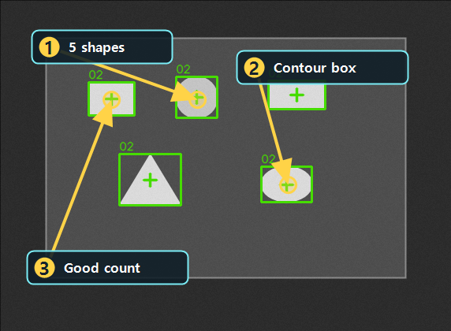

# Contour로 모양 개수 확인하기

Updated: 2026-07-02

Contour는 Threshold 이후 분리된 영역의 외곽선을 찾아서 개수와 면적 조건을 확인하는 도구입니다.
Blob이 연결된 영역의 수량을 빠르게 보는 쪽에 가깝다면, Contour는 외곽선과 shape 조건을 더 직접적으로 봅니다.

## 사용할 public sample

| 역할 | SampleName | 기준 |
| --- | --- | --- |
| Good | `Public_Contour_Shapes_Good` | `ResultCount=5` |
| Bad | `Public_Contour_Shapes_Missing_Bad` | `ResultCount=2` |

두 샘플은 같은 `Public_Contour_Shapes.pipeline.xml`을 사용합니다.
Good은 shape 5개가 모두 남아 있고, Bad는 missing-shape 이미지라 2개만 남습니다.

## 결과 근거 이미지

아래 이미지는 현재 public catalog runner를 현재 코드 기준으로 실행해 생성한 결과입니다.
박스와 중심점이 5개 shape에 모두 붙어야 정상 검출로 볼 수 있습니다.

## 보는 순서

1. Contour Tool을 엽니다.
2. 입력 Layer가 Threshold 결과인지 확인합니다.
3. `DrawMode`가 외곽선 확인에 맞는지 봅니다.
4. `MIN_AREA`, `MAX_AREA`가 실제 shape 크기를 포함하는지 확인합니다.
5. Preview를 실행합니다.
6. overlay가 shape 외곽에 붙는지 확인합니다.
7. Pipeline Review에서 `ResultCount`가 Good/Bad를 분리하는지 봅니다.

## 실패 원인

| 증상 | 먼저 볼 것 |
| --- | --- |
| ROI 전체가 하나로 잡힘 | threshold polarity, 배경 분리, `RetrievalMode` |
| shape가 빠짐 | threshold 값, 최소 면적, ROI |
| 작은 noise가 같이 잡힘 | 최소 면적, morphology cleanup |
| Good/Bad가 분리되지 않음 | count 기준 외에 `AreaMax`, `BoundsWidthMax` 추가 검토 |

## 완료 기준

- Good 샘플에서 contour 5개가 검출됩니다.
- Bad 샘플에서 `ResultCount=2`로 missing 상태가 설명됩니다.
- Contour display 옵션은 표시만 바꾸고 Preview/Run을 자동 실행하지 않습니다.
