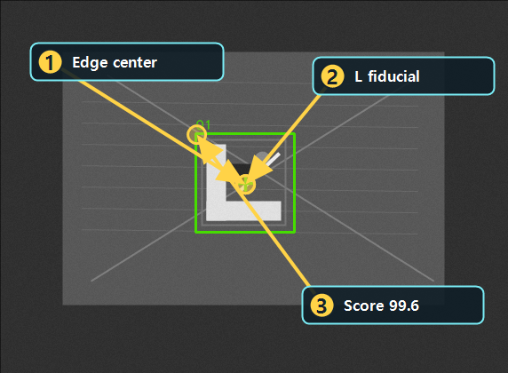

# EdgeBasedMatching 형상 비교하기

Updated: 2026-07-02

EdgeBasedMatching은 픽셀 밝기 자체보다 edge 형상을 기준으로 대상을 찾는 도구입니다.
채색이나 조명 변화가 있어도 edge 구조가 안정적이면 유리하지만, 비슷한 edge 형상이 가까이 있으면 ROI와 기준 점수 관리가 중요합니다.

## 사용할 public sample

| 역할 | SampleName | 기준 |
| --- | --- | --- |
| Good | `Public_Edge_Fiducial_Good` | `ScoreMax >= 70`, `ResultCount=1` |
| Bad | `Public_Edge_Fiducial_Wrong_Bad` | `ResultCount=0` |

두 샘플은 같은 `Public_Edge_Fiducial.pipeline.xml`을 사용합니다.
Good은 L 형태 fiducial을 찾고, Bad는 T 형태의 wrong fiducial이라 no-result가 되어야 합니다.

## 결과 근거 이미지

아래 이미지는 현재 public catalog runner를 현재 코드 기준으로 실행해 생성한 결과입니다.
박스 중심이 L fiducial의 edge 구조에 붙고, Bad에서는 `ResultCount=0`으로 reject되는지를 봅니다.

## 보는 순서

1. EdgeBasedMatching Tool을 엽니다.
2. pattern path가 준비되어 있는지 확인합니다.
3. Canny low/high, score, search step, max template points를 봅니다.
4. Preview를 실행합니다.
5. overlay box가 edge fiducial 중심에 붙는지 확인합니다.
6. Bad 샘플에서 `ResultCount=0`이 되는지 확인합니다.
7. Pipeline Review에서 `MatchingNoResult`가 나오더라도 controlled NG인지 봅니다.

## 실패 원인

| 증상 | 먼저 볼 것 |
| --- | --- |
| Good에서 no-result | Canny threshold, template edge contrast, score 기준 |
| Bad에서도 match | score 기준이 낮거나 edge 형상이 너무 비슷한지 확인 |
| 위치가 흔들림 | ROI, search step, position refine |
| 느림 | ROI 축소, search step, angle search 사용 여부 |

## 완료 기준

- Good 샘플에서 L fiducial 1개가 검출됩니다.
- Bad 샘플에서 `ResultCount=0`으로 reject됩니다.
- angle/search/pyramid 같은 비용 큰 옵션은 필요할 때만 켭니다.
