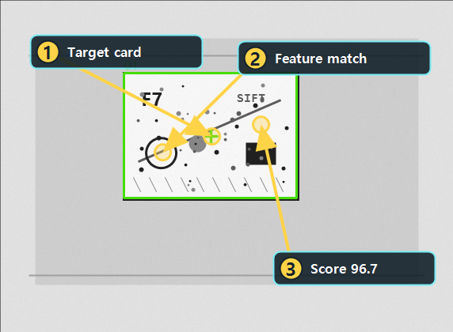

# FeatureMatching 점수 비교하기

Updated: 2026-07-14

FeatureMatching은 template의 특징점과 대상 이미지의 특징점을 비교해서 비슷한 대상을 찾는 도구입니다.
일반 Matching보다 배경이나 밝기 변화에 더 버틸 수 있지만, 특징점이 부족하거나 반복 패턴이 많으면 오검출 위험이 있습니다.

## 사용할 public sample

| 역할 | SampleName | 기준 |
| --- | --- | --- |
| Good | `Public_Feature_Card_Good` | `ScoreMax >= 80`, `ResultCount=1..3` |
| Bad | `Public_Feature_Card_Wrong_Bad` | `ScoreMax=20..35` |

두 샘플은 같은 `Public_Feature_Card.pipeline.xml`을 사용합니다.
Good은 feature-rich card가 template과 맞고, Bad는 다른 card라 score가 낮습니다.

## 결과 근거 이미지

아래 이미지는 현재 public catalog runner를 현재 코드 기준으로 실행해 생성한 결과입니다.
박스가 실제 card에 붙고, `ScoreMax`가 기준 이상인지 같이 봐야 합니다.

## 보는 순서

1. FeatureMatching Tool을 엽니다.
2. template 경로가 준비되어 있는지 확인합니다.
3. 입력 Layer와 출력 Layer가 분리되어 있는지 봅니다.
4. `Ratio 기준`과 RANSAC 허용 오차를 확인합니다. Ratio는 작을수록 descriptor 매칭을 엄격하게 거릅니다.
5. Preview를 실행합니다.
6. overlay가 실제 card 위치에 붙는지 확인합니다.
7. Bad 샘플에서 `ScoreMax`가 기준 아래로 떨어지는지 봅니다.

## 실패 원인

| 증상 | 먼저 볼 것 |
| --- | --- |
| 특징점이 부족함 | template이 너무 단순한지, contrast가 낮은지 확인 |
| 엉뚱한 곳에 붙음 | 반복 패턴, ROI, RANSAC 기준 |
| Good score가 낮음 | template crop, scale/rotation 차이, feature detector 설정 |
| Bad score가 높음 | template 고유성이 부족하거나 기준이 너무 낮은지 확인 |

## 완료 기준

- Good 샘플에서 target card가 검출됩니다.
- Bad 샘플에서 score가 낮아 controlled NG가 됩니다.
- Score만 보지 않고 overlay 위치와 `ResultCount`를 같이 확인합니다.

## Matching Family Selection

| Intent | Use Tool | Primary Signal | First Metric | Common Risk |
| --- | --- | --- | --- | --- |
| Stable brightness/template appearance | Matching | Pixel intensity template score | ScoreMax, ResultCount | Lighting and background variation |
| Shape survives lighting but edge geometry is stable | EdgeBasedMatching | Canny/edge shape score | ScoreMax, ResultCount | Weak or repeated edge shape |
| Target changes scale/rotation/view but local features remain | FeatureMatching | Keypoint/descriptor matches | ResultCount, ScoreMax | Too few keypoints or repeated texture |

After changing FeatureMatching parameters, run Preview or Run Review and compare the overlay, `ScoreMax`, `ResultCount`, and RANSAC result.

## Learn에서 Tool View 열기

FeatureMatching Learn의 `FeatureMatching Tool 열기`에서 Template, Ratio, RANSAC, ROI 값을 설정합니다.
Tool Shell의 `Template Ready`와 PropertyGrid의 `Feature template path`,
`Matching > Ratio threshold`, `RANSAC tolerance`, ROI를 확인합니다. XML 키는
호환성을 위해 `SCORE_MIN`이지만, 실제 의미는 Lowe Ratio 기준이며 작을수록 엄격합니다.
Preview 또는 Run Review 후 overlay 위치, `ScoreMax`, `ResultCount`를
함께 판정합니다. Good/Bad 쌍에서 특징점 수와 RANSAC 결과가 안정적으로 구분되는지 확인합니다.
