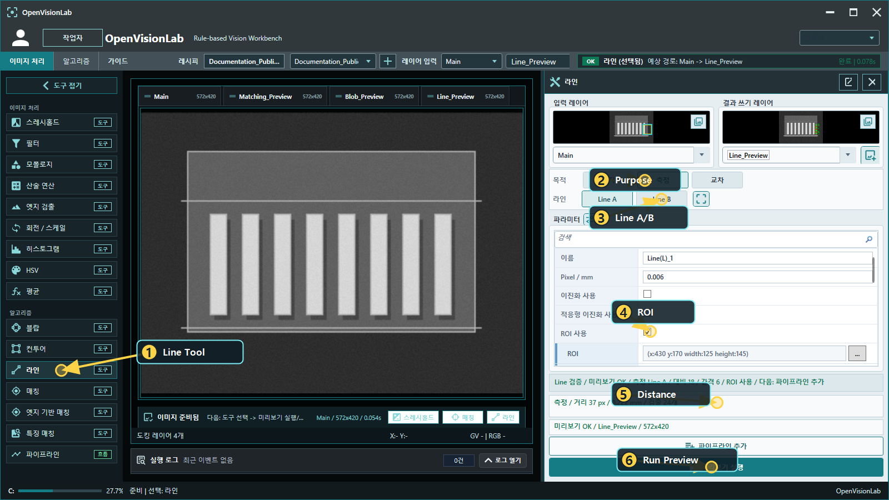
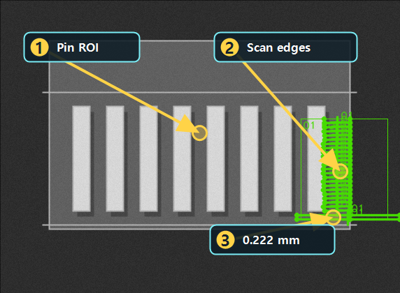

# Line으로 거리 보기

Updated: 2026-07-02

Line은 edge를 기준으로 직선, 각도, 거리, 교차점을 확인하는 도구입니다.
Line 계열은 선이 그려졌는지만 보면 부족합니다. ROI, scan direction, polarity, pixel/mm, metric을 같이 봐야 합니다.

## 사용할 public sample

| 역할 | SampleName | 기준 |
| --- | --- | --- |
| Good | `Public_Line_Pins_Good` | `DistanceMmAvg=0.20..0.25` |
| Bad | `Public_Line_Pins_WidePin_Bad` | `DistanceMmAvg=0.09..0.13` |

두 샘플은 같은 `Public_Line_Pins_Distance.pipeline.xml`을 사용합니다.
Good은 정상 pin 간격을 만들고, Bad는 같은 설정에서 더 좁은 거리로 controlled NG가 됩니다.

## 결과 근거 이미지

아래 이미지는 현재 public catalog runner를 현재 코드 기준으로 실행해 생성한 결과입니다.
오른쪽 pin 영역에서 scan edge와 distance metric이 함께 생성되는지 확인합니다.

## 보는 순서

1. Line Tool을 엽니다.
2. Purpose가 `Measure`인지 확인합니다.
3. Line A/B가 서로 다른 edge를 향해 scan하는지 봅니다.
4. ROI가 필요한 edge만 포함하는지 확인합니다.
5. Preview를 실행합니다.
6. `DistanceMmAvg`를 봅니다. 거리 측정에서는 `LineLength`가 아니라 `Distance` 계열 metric이 기준입니다.
7. Bad 샘플에서 같은 pipeline이 거리 기준으로 NG를 만드는지 확인합니다.

## 실패 원인

| 증상 | 먼저 볼 것 |
| --- | --- |
| edge가 안 잡힘 | ROI, contrast, polarity |
| 엉뚱한 edge에 붙음 | ROI가 너무 넓은지, scan direction이 맞는지 확인 |
| 거리값이 이상함 | Line A/B 방향, pixel/mm, 측정선이 잡는 edge |
| Good/Bad 차이가 약함 | `DistanceMmAvg`, `DistanceCount` 중 어떤 metric이 분리하는지 확인 |

## 완료 기준

- Good 샘플에서 pin 간격이 정상 범위입니다.
- Bad 샘플에서 `DistanceMmAvg` 기준으로 NG가 설명됩니다.
- ROI overlay와 결과 overlay가 같은 검사 의도를 가리킵니다.
Opening this guide or changing Line/LineDistance parameters must not run Preview/Run automatically.
