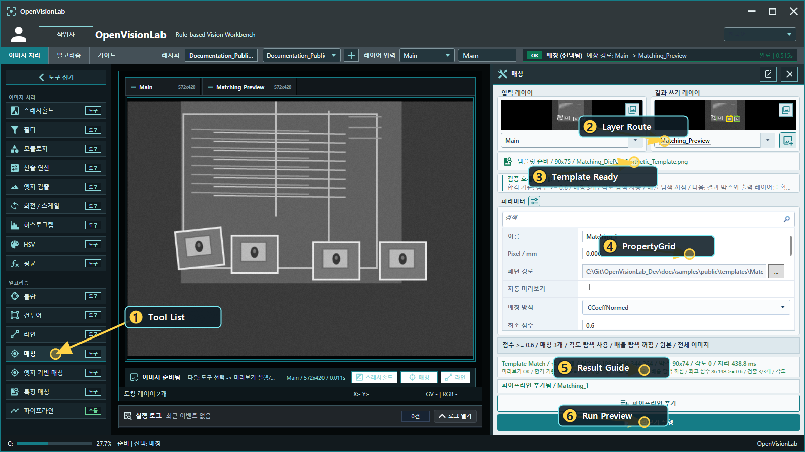
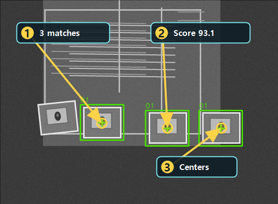
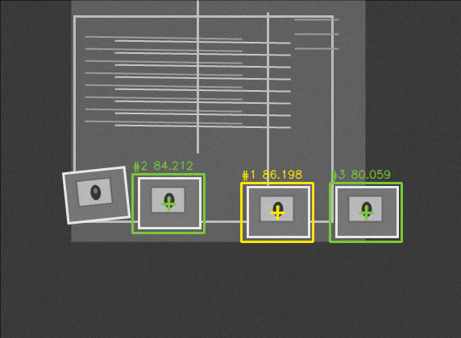

# Matching 배우기

Updated: 2026-07-02

Matching은 기준 template과 비슷한 대상을 이미지 안에서 찾는 도구입니다.
처음 볼 때는 `ScoreMax`만 보지 말고 template, 검출 위치, 중심점, output layer를 같이 봐야 합니다.

## 사용할 public sample

| 역할 | SampleName | 기준 |
| --- | --- | --- |
| Good | `Public_Matching_DiePad_Good` | `ResultCount=3`, `ScoreMax >= 80` |
| Bad | `Public_Matching_DiePad_NoTarget_Bad` | `ResultCount=0` |

두 샘플은 같은 `Public_Matching_DiePad.pipeline.xml`을 사용합니다.
Good에서만 세 대상이 맞고 Bad에서 no-result가 나와야 template이 구분력을 가진 것입니다.

## 결과 근거 이미지

아래 이미지는 현재 public catalog runner를 현재 코드 기준으로 실행해 생성한 결과입니다.
검출 박스와 중심점이 실제 die pad 중앙에 붙고, 세 개 모두 찾아야 정상입니다.

아래 이미지는 현재 EXE에서 Matching Preview를 실행했을 때의 실제 preview 결과입니다.
문서에는 수동으로 보기 좋게 그린 박스를 쓰지 않고, Preview가 만든 overlay 결과만 사용합니다.

## 보는 순서

1. `Tool List`에서 Matching을 엽니다.
2. `Layer Route`에서 입력은 `Main`, 출력은 `Matching_Preview`인지 확인합니다.
3. `Template Ready` 상태를 봅니다. template이 없으면 score 해석 자체가 의미 없습니다.
4. PropertyGrid에서 score, count, angle/scale 옵션을 확인합니다.
5. `Run Preview`를 명시적으로 누릅니다.
6. overlay box와 중심점이 실제 대상 위에 있는지 봅니다.
7. Pipeline Review에서 `ResultCount`와 `ScoreMax`가 함께 기준으로 설명되는지 확인합니다.

## 실패 원인

| 증상 | 먼저 볼 것 |
| --- | --- |
| 후보가 없음 | template 경로, score 기준, ROI |
| 엉뚱한 곳을 찾음 | template crop이 너무 넓은지, 배경이 많이 들어가는지 확인 |
| 후보가 너무 많음 | score 기준, ROI, template 고유성 |
| Good은 OK인데 Bad도 OK | template이 너무 단순하거나 score 기준이 낮은지 확인 |

## 완료 기준

- Good 샘플에서 대상 3개가 검출됩니다.
- Bad 샘플에서 `ResultCount=0`으로 reject됩니다.
- Output Layer가 따로 생성되어도 Input Layer가 몰래 바뀌지 않습니다.

## Matching Family Selection

| Intent | Use Tool | Primary Signal | First Metric | Common Risk |
| --- | --- | --- | --- | --- |
| Stable brightness/template appearance | Matching | Pixel intensity template score | ScoreMax, ResultCount | Lighting and background variation |
| Shape survives lighting but edge geometry is stable | EdgeBasedMatching | Canny/edge shape score | ScoreMax, ResultCount | Weak or repeated edge shape |
| Target changes scale/rotation/view but local features remain | FeatureMatching | Keypoint/descriptor matches | ResultCount, ScoreMax | Too few keypoints or repeated texture |

Use explicit Preview/Run only. Opening this guide or changing Matching parameters must not run Preview/Run automatically.
