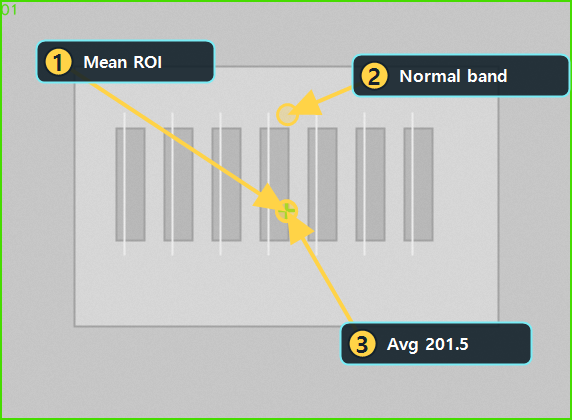

# Mean으로 밝기 drift 확인하기

Updated: 2026-07-02

Mean은 이미지나 ROI의 평균 밝기를 확인하는 단순하지만 중요한 도구입니다.
조명 drift, 노출 부족, 배경 밝기 변화처럼 위치 검출보다 전체 밝기 기준이 중요한 경우에 사용합니다.

## 사용할 public sample

| 역할 | SampleName | 기준 |
| --- | --- | --- |
| Good | `Public_Mean_Brightness_Good` | `MeanValueAvg=185..220` |
| Bad | `Public_Mean_Brightness_Dark_Bad` | `MeanValueAvg=105..130` |

두 샘플은 같은 `Public_Mean_BrightnessDrift.pipeline.xml`을 사용합니다.
Good은 정상 밝기 band 안에 있고, Bad는 underexposure라 평균 밝기가 낮습니다.

## 결과 근거 이미지

아래 이미지는 현재 public catalog runner를 현재 코드 기준으로 실행해 생성한 결과입니다.
Mean은 박스 검출형 도구가 아니므로, 이미지의 같은 영역에서 평균 밝기 metric이 정상 범위에 들어오는지 봅니다.

## 보는 순서

1. Mean Tool을 엽니다.
2. 입력 Layer가 검사하려는 이미지인지 확인합니다.
3. ROI를 쓴다면 같은 위치를 Good/Bad에 적용합니다.
4. Preview를 실행합니다.
5. `MeanValueAvg`가 기준 범위 안에 있는지 봅니다.
6. Pipeline Review에서 밝기 drift가 metric으로 설명되는지 확인합니다.

## 실패 원인

| 증상 | 먼저 볼 것 |
| --- | --- |
| Good이 NG | ROI가 어두운 배경을 많이 포함하는지, 기준 범위가 너무 좁은지 확인 |
| Bad가 OK | 기준 범위가 너무 넓은지, ROI가 drift 영역을 놓쳤는지 확인 |
| 이미지마다 흔들림 | 조명 편차, normalize 전처리 필요 여부 |
| 결과 해석이 약함 | 평균만 보지 말고 min/max 또는 histogram을 같이 볼지 검토 |

## 완료 기준

- Good 샘플은 정상 밝기 band 안에 들어옵니다.
- Bad 샘플은 `MeanValueAvg`가 낮아 NG 이유가 명확합니다.
- 밝기 기준이 이미지 전체인지 ROI인지 문서와 recipe에서 분명해야 합니다.
Opening this guide or changing Mean parameters must not run Preview/Run automatically.

## Beginner path handoff

- Previous concept: read `LEARN_OPENCVSHARP_FOUNDATIONS.md` until pixel, GV, ROI, `Rect`, `Mat`, `InputLayer`, and `OutputLayer` are clear.
- This topic goal: prove that brightness drift changes `MeanValueAvg` on `Public_Mean_Brightness_Good` and `Public_Mean_Brightness_Dark_Bad`.
- Practice Samples path: `mean`.
- Explicit action: open the public Good sample, run review manually, then repeat with the Bad sample.
- Next topic: move to Threshold only after the operator can explain why a GV change should move a threshold boundary.
- Do not skip: metric and Good/Bad comparison. A visual difference without `MeanValueAvg` evidence is not enough.
