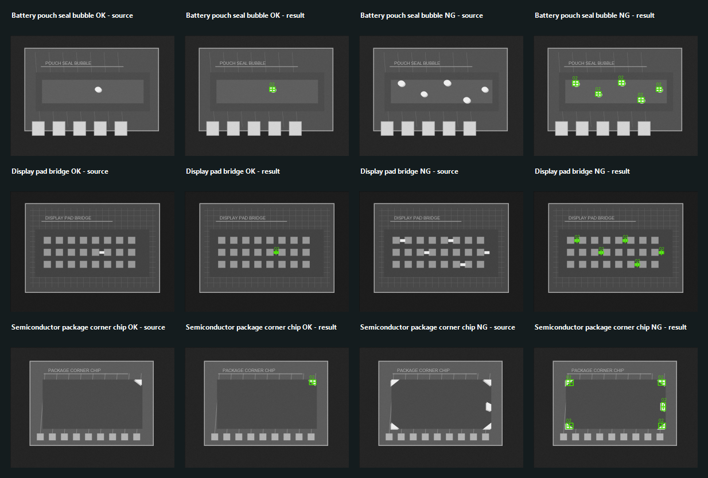
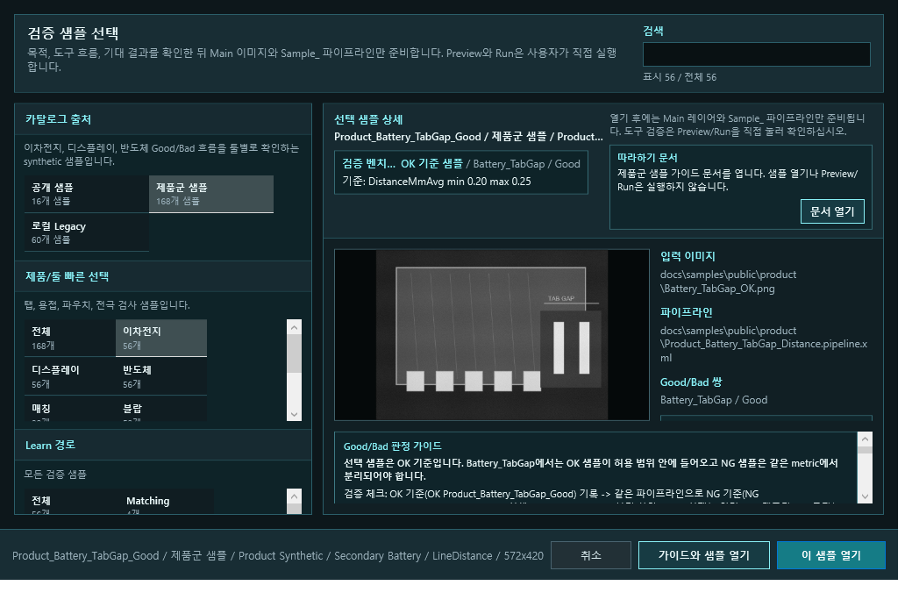
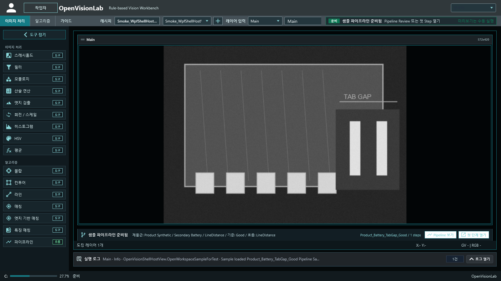
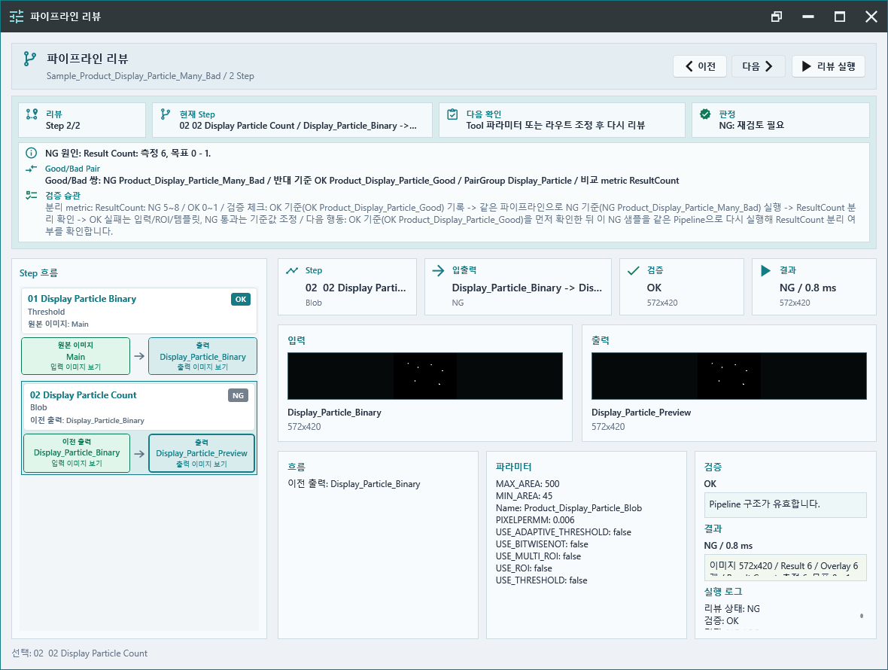

# Product Sample Guide

Updated: 2026-07-03

This guide uses only OpenVisionLab-generated synthetic images from the public sample catalog. The goal is to practice rule-based inspection with product-like scenes before using real production images.

OpenVisionLab samples are not meant to prove that one parameter is always correct. They show the basic review habit:

1. Open the Good image and check the expected metric.
2. Open the Bad image from the same PairGroup.
3. Run the same pipeline.
4. Confirm that the metric explains why the Bad image becomes NG.

## Current Product Set

| Domain | PairGroup | Tool flow | Good decision | Bad decision |
| --- | --- | --- | --- | --- |
| Secondary battery | `Battery_TabGap` | LineDistance | `DistanceMmAvg 0.20..0.25` | narrow tab gap, `0.09..0.14` |
| Secondary battery | `Battery_WeldSpatter` | Threshold -> Blob | `ResultCount 3..8` | too many bright weld candidates, `10..16` |
| Secondary battery | `Battery_WeldOverburn` | Threshold -> Blob | `ResultCount 0..1` | too many overburn hot spots, `4..7` |
| Secondary battery | `Battery_TabTear` | Threshold -> Contour | `ResultCount 0..1` | too many torn-tab candidates, `4..7` |
| Secondary battery | `Battery_TabPlatingPeel` | Threshold -> Contour | `ResultCount 0..1` | too many plating-peel candidates, `4..7` |
| Secondary battery | `Battery_ElectrolyteStain` | Mean | `MeanValueAvg 70..96` | heavy electrolyte stain, `106..150` |
| Secondary battery | `Battery_SeparatorWrinkle` | Threshold -> Contour | `ResultCount 0..1` | too many separator wrinkle candidates, `3..6` |
| Secondary battery | `Battery_SeparatorPinhole` | Threshold -> Blob | `ResultCount 0..1` | too many separator pinhole candidates, `4..7` |
| Secondary battery | `Battery_CoatingGap` | LineDistance | `DistanceMmAvg 0.20..0.25` | coating gap too narrow, `0.09..0.14` |
| Secondary battery | `Battery_ForeignObject` | Threshold -> Blob | `ResultCount 0..1` | too many bright foreign-object candidates, `3..5` |
| Secondary battery | `Battery_EdgeBurr` | Threshold -> Contour | `ResultCount 0..1` | too many coating-edge burr candidates, `4..7` |
| Secondary battery | `Battery_TabOffset` | LineDistance | `DistanceMmAvg 0.20..0.25` | shifted tab clearance, `0.09..0.14` |
| Secondary battery | `Battery_SealWidth` | LineDistance | `DistanceMmAvg 0.20..0.26` | seal band too narrow, `0.09..0.14` |
| Secondary battery | `Battery_TabWeldVoid` | Threshold -> Blob | `ResultCount 0..1` | too many tab-weld void candidates, `4..8` |
| Secondary battery | `Battery_PouchEdgeFold` | Threshold -> Contour | `ResultCount 0..1` | too many pouch-edge fold candidates, `4..7` |
| Secondary battery | `Battery_PouchSealBurn` | Threshold -> Blob | `ResultCount 0..1` | too many pouch-seal burn candidates, `4..7` |
| Secondary battery | `Battery_PouchSealBubble` | Threshold -> Blob | `ResultCount 0..1` | too many pouch-seal bubble candidates, `4..7` |
| Secondary battery | `Battery_SealEdgeDelamination` | Threshold -> Contour | `ResultCount 0..1` | too many seal-edge delamination candidates, `4..7` |
| Secondary battery | `Battery_TabOxidation` | Threshold -> Contour | `ResultCount 0..1` | too many tab-oxidation candidates, `4..7` |
| Secondary battery | `Battery_TabDiscoloration` | Mean | `MeanValueAvg 145..180` | dark tab discoloration, `90..130` |
| Secondary battery | `Battery_SealContamination` | Threshold -> Blob | `ResultCount 0..1` | too many seal-contamination candidates, `4..7` |
| Secondary battery | `Battery_LaserMark` | Image Matching | one mark with score above 72 | missing mark, no result |
| Secondary battery | `Battery_TabDateCode` | Image Matching | one tab date-code mark with score above 72 | wrong or missing mark, no result |
| Secondary battery | `Battery_ElectrolyteFillLine` | LineDistance | `DistanceMmAvg 0.20..0.26` | low fill-line offset, `0.09..0.14` |
| Secondary battery | `Battery_CellVentAlignment` | LineDistance | `DistanceMmAvg 0.20..0.26` | shifted cell vent alignment, `0.09..0.14` |
| Secondary battery | `Battery_PouchTabSkew` | LineDistance | `DistanceMmAvg 0.20..0.26` | shifted pouch tab skew, `0.09..0.14` |
| Secondary battery | `Battery_CurrentCollectorBurr` | Threshold -> Contour | `ResultCount 0..1` | too many current-collector burr candidates, `4..7` |
| Secondary battery | `Battery_SeparatorEdgeTear` | Threshold -> Contour | `ResultCount 0..1` | too many separator edge-tear candidates, `4..7` |
| Display | `Display_PixelDefect` | Threshold -> Contour | `ResultCount 0..3` | too many bright pixel defects, `6..9` |
| Display | `Display_Alignment` | Image Matching | one mark with score above 75 | no matching target |
| Display | `Display_Scratch` | Threshold -> Contour | `ResultCount 0..1` | too many scratch candidates, `3..6` |
| Display | `Display_BrightnessBand` | Mean | `MeanValueAvg 70..95` | bright mura band, `110..155` |
| Display | `Display_Particle` | Threshold -> Blob | `ResultCount 0..1` | too many bright particle candidates, `5..8` |
| Display | `Display_MuraVariation` | Mean | `MeanValueAvg 78..96` | uneven mura band, `115..145` |
| Display | `Display_EdgeChip` | Threshold -> Contour | `ResultCount 0..1` | too many edge-chip candidates, `3..6` |
| Display | `Display_BezelChip` | Threshold -> Contour | `ResultCount 0..1` | too many bezel-chip candidates, `4..7` |
| Display | `Display_CornerCrack` | Threshold -> Contour | `ResultCount 0..1` | too many corner-crack candidates, `3..6` |
| Display | `Display_CornerLightLeak` | Mean | `MeanValueAvg 75..98` | bright corner light leak, `110..160` |
| Display | `Display_BlackMatrixScratch` | Threshold -> Contour | `ResultCount 0..1` | too many black-matrix scratch candidates, `4..7` |
| Display | `Display_LineDropout` | Threshold -> Contour | `ResultCount 0..1` | too many line-dropout gaps, `4..7` |
| Display | `Display_MuraSpotCluster` | Threshold -> Contour | `ResultCount 0..1` | too many mura spot candidates, `4..7` |
| Display | `Display_MuraRing` | Threshold -> Contour | `ResultCount 0..1` | too many mura ring candidates, `4..7` |
| Display | `Display_PolarizerScratch` | Threshold -> Contour | `ResultCount 0..1` | too many polarizer scratch candidates, `4..7` |
| Display | `Display_PolarizerCrease` | Threshold -> Contour | `ResultCount 0..1` | too many polarizer crease candidates, `4..7` |
| Display | `Display_SealWidth` | LineDistance | `DistanceMmAvg 0.20..0.26` | seal band too narrow, `0.09..0.14` |
| Display | `Display_AlignmentOffset` | LineDistance | `DistanceMmAvg 0.20..0.26` | shifted alignment offset, `0.09..0.14` |
| Display | `Display_ColorFilterShift` | LineDistance | `DistanceMmAvg 0.20..0.26` | shifted color-filter registration, `0.09..0.14` |
| Display | `Display_LineStain` | Threshold -> Contour | `ResultCount 0..1` | too many line-stain candidates, `3..6` |
| Display | `Display_SubpixelBridge` | Threshold -> Blob | `ResultCount 0..1` | too many subpixel bridge candidates, `4..7` |
| Display | `Display_PadBridge` | Threshold -> Blob | `ResultCount 0..1` | too many pad bridge candidates, `4..7` |
| Display | `Display_PolarizerBubble` | Threshold -> Blob | `ResultCount 0..1` | too many polarizer bubble candidates, `4..7` |
| Display | `Display_SealContamination` | Threshold -> Blob | `ResultCount 0..1` | too many seal-contamination candidates, `4..7` |
| Display | `Display_SealCornerContamination` | Threshold -> Blob | `ResultCount 0..1` | too many seal-corner contamination candidates, `4..7` |
| Display | `Display_PolarizerEdgeLift` | Threshold -> Contour | `ResultCount 0..1` | too many polarizer edge-lift candidates, `4..7` |
| Display | `Display_CofBondParticle` | Threshold -> Blob | `ResultCount 0..1` | too many COF bond particle candidates, `4..7` |
| Display | `Display_FpcAlignmentMark` | Image Matching | one FPC alignment mark with score above 72 | wrong mark, no result |
| Semiconductor | `Semiconductor_Fiducial` | EdgeBasedMatching | one fiducial with score above 70 | wrong edge shape, no result |
| Semiconductor | `Semiconductor_BondMark` | FeatureMatching | score above 80 | low score / wrong mark |
| Semiconductor | `Semiconductor_PadContamination` | Threshold -> Blob | `ResultCount 0..2` | too many bright contamination candidates, `5..8` |
| Semiconductor | `Semiconductor_PadPitch` | LineDistance | `DistanceMmAvg 0.20..0.25` | narrow pad pitch, `0.09..0.14` |
| Semiconductor | `Semiconductor_RotationMark` | EdgeBasedMatching | `AngleAvg -5..5` | rotated mark, `-22..-10` |
| Semiconductor | `Semiconductor_LeadAlignment` | LineDistance | `DistanceMmAvg 0.20..0.25` | shifted lead clearance, `0.09..0.14` |
| Semiconductor | `Semiconductor_LeadWidth` | LineDistance | `DistanceMmAvg 0.20..0.26` | narrow lead width, `0.09..0.14` |
| Semiconductor | `Semiconductor_LeadCoplanarity` | LineDistance | `DistanceMmAvg 0.20..0.25` | shifted lead-foot clearance, `0.09..0.14` |
| Semiconductor | `Semiconductor_ProbeMark` | Threshold -> Blob | `ResultCount 0..1` | too many probe-mark candidates, `4..7` |
| Semiconductor | `Semiconductor_DieEdgeChip` | Threshold -> Contour | `ResultCount 0..1` | too many die-edge chip candidates, `4..7` |
| Semiconductor | `Semiconductor_MoldingFlash` | Threshold -> Contour | `ResultCount 0..1` | too many molding-flash candidates, `4..7` |
| Semiconductor | `Semiconductor_PackageCrack` | Threshold -> Contour | `ResultCount 0..1` | too many package-crack candidates, `4..7` |
| Semiconductor | `Semiconductor_PackageCornerChip` | Threshold -> Contour | `ResultCount 0..1` | too many package corner-chip candidates, `4..7` |
| Semiconductor | `Semiconductor_LeadBurr` | Threshold -> Contour | `ResultCount 0..1` | too many lead-burr candidates, `4..7` |
| Semiconductor | `Semiconductor_LeadCrack` | Threshold -> Contour | `ResultCount 0..1` | too many lead-crack candidates, `4..7` |
| Semiconductor | `Semiconductor_LeadOxidation` | Threshold -> Blob | `ResultCount 0..1` | too many lead-oxidation candidates, `4..7` |
| Semiconductor | `Semiconductor_PackagePolarity` | Image Matching | one polarity mark with score above 72 | missing polarity mark, no result |
| Semiconductor | `Semiconductor_PackageLaserText` | Image Matching | one laser text mark with score above 72 | missing laser text, no result |
| Semiconductor | `Semiconductor_WaferDieMark` | Image Matching | one mark with score above 72 | wrong die mark, no result |
| Semiconductor | `Semiconductor_DieContamination` | Threshold -> Blob | `ResultCount 0..2` | too many die contamination candidates, `5..8` |
| Semiconductor | `Semiconductor_UnderfillVoid` | Threshold -> Blob | `ResultCount 0..1` | too many underfill void candidates, `4..7` |
| Semiconductor | `Semiconductor_PackageVoid` | Threshold -> Blob | `ResultCount 0..1` | too many package void candidates, `4..7` |
| Semiconductor | `Semiconductor_SolderBridge` | Threshold -> Blob | `ResultCount 0..1` | too many solder-bridge candidates, `4..7` |
| Semiconductor | `Semiconductor_PadScratch` | Threshold -> Contour | `ResultCount 0..1` | too many pad-scratch candidates, `4..7` |
| Semiconductor | `Semiconductor_BondPadNick` | Threshold -> Contour | `ResultCount 0..1` | too many bond-pad nick candidates, `4..7` |
| Semiconductor | `Semiconductor_WireBondLift` | Threshold -> Blob | `ResultCount 0..1` | too many wire-bond lift candidates, `4..7` |
| Semiconductor | `Semiconductor_WireSweepAlignment` | LineDistance | `DistanceMmAvg 0.20..0.26` | shifted wire sweep alignment, `0.09..0.14` |
| Semiconductor | `Semiconductor_BondPadCorrosion` | Threshold -> Blob | `ResultCount 0..1` | too many bond-pad corrosion candidates, `4..7` |

## Evidence Image

The image below is generated from the current sample catalog result folder. It compares source and result images for the latest large-context product pairs.

Read it from left to right:

1. Source shows what the operator would inspect.
2. Result shows what the current pipeline measured or counted.
3. Good and Bad use the same pipeline, so the metric difference is the important part.

## Start From A Product Focus

When the catalog has many samples, start by narrowing it down before opening anything.

1. Choose `Product`.
2. Choose the product family or tool family you want to practice.
3. Open a Good sample first. The Bad sample should come from the same PairGroup.

After opening the sample, check the workflow bar below the image. It should show the sample name, product category, Good/Bad role, and tool flow. Opening a sample prepares the image and pipeline only; Preview/Run still starts from an explicit user action.

Use `Pipeline Review` when you want to inspect every step before accepting the result. The review panel should show the `Good/Bad Pair` line first: current sample, opposite reference, PairGroup, and the metric to compare. Then read the review habit, output preview, result detail, and run log.

## How To Review A Pair

1. Open the sample catalog and choose `Product`.
2. Pick a Good row first. For example, `Product_Display_Particle_Good`.
3. Open the sample. This prepares the image and `Sample_` pipeline only; it does not run Preview or Run.
4. Run the prepared sample pipeline in Pipeline Review.
5. Check the `Good/Bad Pair` line. For `Display_Particle`, it should point from `Product_Display_Particle_Good` to `Product_Display_Particle_Many_Bad` and use `ResultCount`.
6. Check the output image, overlay, metric, and log together. The Good sample should stay inside `ResultCount 0..1`.
7. Open the Bad row from the same PairGroup, for example `Product_Display_Particle_Many_Bad`.
8. Run the same pipeline again. The Bad sample should become NG because the candidate count is above the Good limit.
9. Only after Good and Bad explain the same rule should the setting be treated as a useful starting point.

The NG review should make the failure reason visible without guessing from the image alone.

## What To Fix First

| Symptom | First check |
| --- | --- |
| Good sample fails | ROI is hitting the wrong edge, threshold is too strict, or score/count gate is too tight. |
| Bad sample passes | Acceptance range is too loose, ROI includes a distractor, or the chosen metric does not separate the pair. |
| Result image looks empty | The pipeline may still be correct if the metric is a no-result gate. Check the report first. |
| Many false candidates appear | Narrow the ROI, raise the threshold, or increase the minimum area/score. |

## Completion Criteria

- Good samples produce OK with the expected metric range.
- Bad samples produce controlled NG with the same pipeline.
- The result can be explained by image, overlay, metric, and log together.
- Input and output layers stay explicit; opening a sample or guide does not run Preview/Run.

Next improvement: keep the catalog stable and improve the review habit around Good/Bad comparison. Add new samples only when the new pair teaches a distinct product-like failure case that is not already covered.
