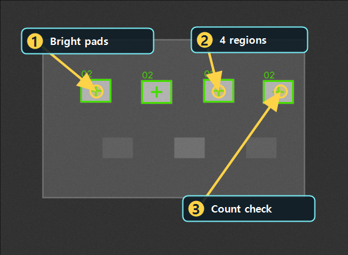

# Threshold로 밝은 영역 분리하기

Updated: 2026-07-02

Threshold는 이미지를 이진화해서 다음 도구가 읽기 쉬운 Layer를 만드는 시작점입니다.
Threshold 자체가 최종 검사일 수도 있지만, 실제로는 Blob이나 Contour 앞단에서 더 자주 중요해집니다.

## 사용할 public sample

| 역할 | SampleName | 기준 |
| --- | --- | --- |
| Good | `Public_Threshold_BandPads_Good` | `ResultCount=4` |
| Bad | `Public_Threshold_BandPads_Missing_Bad` | `ResultCount=1` |

두 샘플은 같은 `Public_Threshold_BandPads.pipeline.xml`을 사용합니다.
pipeline은 Threshold로 밝은 pad를 분리하고, 후속 Contour count로 결과를 검증합니다.

## 결과 근거 이미지

아래 이미지는 현재 public catalog runner를 현재 코드 기준으로 실행해 생성한 결과입니다.
Threshold가 분리한 밝은 pad 4개가 후속 count에서 정상 영역으로 잡히는지를 확인합니다.

## 보는 순서

1. Threshold Tool을 엽니다.
2. 입력 Layer가 `Main`인지 확인합니다.
3. 결과 Layer를 원본과 다른 이름으로 둡니다.
4. threshold 값과 polarity를 조정합니다.
5. Preview를 실행합니다.
6. 흰색 영역이 실제 검사 대상만 남기는지 봅니다.
7. Pipeline Review에서 후속 count가 `ResultCount`로 설명되는지 확인합니다.

## 실패 원인

| 증상 | 먼저 볼 것 |
| --- | --- |
| 대상이 사라짐 | threshold 값이 너무 높거나 polarity가 반대인지 확인 |
| 배경 noise가 많음 | threshold 값, blur/filter 전처리 |
| 대상이 서로 붙음 | morphology, threshold 범위 |
| 후속 Tool count가 이상함 | Threshold 결과 Layer가 다음 Step 입력인지 확인 |

## 완료 기준

- Good 샘플에서 밝은 pad 4개가 분리됩니다.
- Bad 샘플에서 pad 1개만 남아 정상 기준을 만족하지 못합니다.
- Preview 결과에서 binary mask와 후속 `ResultCount`가 함께 안정되는지 확인합니다.
After changing Threshold parameters, run Preview and compare object/background separation on the result layer.

## Beginner path handoff

- Previous topic: Mean / Brightness. Confirm the object and background GV ranges before choosing a threshold value.
- This topic goal: isolate bright pads on `Public_Threshold_BandPads_Good` and explain why `Public_Threshold_BandPads_Missing_Bad` fails.
- Practice Samples path: `preprocess`.
- Practice action: open the Threshold Tool View or the public Threshold sample, then click Preview/Run and compare the binary result.
- Next topic: use Filter or Morphology only when Threshold output has noise, holes, or broken regions that would confuse Blob/Contour.
- Always review the output layer and downstream `ResultCount`; a binary image is useful when the next metric remains stable across Good/Bad samples.
