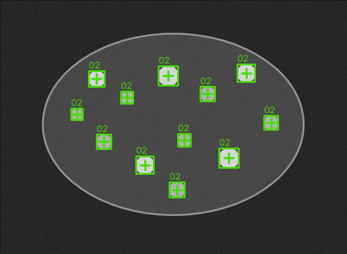

# 처음 실행: 공개 Blob 샘플로 결과 확인

## 목표

프로그램을 처음 열고 공개 샘플을 실행해 `설정`, `실행`, `판정`이 서로 다른
단계라는 것을 확인합니다.

## 순서

1. OpenVisionLab을 실행합니다.
2. 오른쪽 위 언어가 `한국어`인지 확인합니다.
3. 시작 화면의 `샘플 열기`를 누릅니다.
4. 검색창에 `Public_Blob_Particles_Good`를 입력합니다.
5. `ResultCount 8..14` 기준과 Good 역할을 확인합니다.
6. `이 샘플 열기`를 누릅니다. 이미지를 열어도 Pipeline은 실행되지 않습니다.
7. 왼쪽에서 `블랍`을 엽니다.
8. 입력 Layer `Main`, 출력 Layer `Blob_Preview`를 확인합니다.
9. `기본` preset을 선택합니다. preset은 값만 바꾸며 실행하지 않습니다.
10. `미리보기 실행`을 직접 누릅니다.
11. 밝은 입자 12개 위의 box/중심과 `ResultCount=12`가 일치하는지 봅니다.
12. 맞으면 `파이프라인에 추가·저장`을 누릅니다.

## 화면에서 보일 것

- 원본 Layer: `Main`
- 결과 Layer: `Blob_Preview`
- 상태: `미리보기 OK`
- 검출: 12
- 드로잉: 실제 밝은 입자 위의 box와 중심

## 다르면 확인할 것

1. 선택한 샘플 이름
2. Tool 입력 Layer
3. Threshold 방향과 값
4. Area 범위
5. `미리보기 실행`을 실제로 눌렀는지

검출 숫자만 맞고 box가 바깥 타원이나 노이즈 위에 있으면 완료가 아닙니다.
